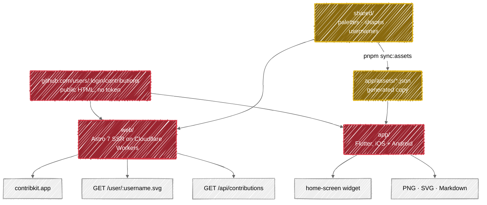
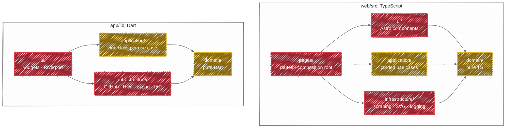

# Architecture

How ContribKit is built, for contributors. What it does and how to use it is the [README](./README.md) and the
user guides in [docs/wiki/](./docs/wiki/), in particular [How It Works](./docs/wiki/How-It-Works.md) and
[Project Structure](./docs/wiki/Project-Structure.md); this document does not restate them. Conventions and the
maintenance contract are [CLAUDE.md](./CLAUDE.md), the domain vocabulary is [CONTEXT.md](./CONTEXT.md), and how to
work on the repo is [CONTRIBUTING.md](./CONTRIBUTING.md).

The thing to understand before anything else: **the same domain is implemented twice**, in TypeScript and in Dart,
deliberately ([ADR 0003](./docs/adr/0003-layered-domain-architecture-in-both-clients.md)). The layering is heavier
than one client would justify. Its job is to keep the two implementations shaped alike, so "does the app do what
the web does?" stays a cheap question to answer.

## 1. Components

| Component | What it is | Released as |
| --- | --- | --- |
| [`web/`](./web/README.md) | Astro 7 (`output: "server"`) on `@astrojs/cloudflare`, serving the site plus the public SVG and JSON endpoints | `web-vX.Y.Z`, deployed to Cloudflare Workers |
| [`app/`](./app/README.md) | Flutter iOS/Android client with home-screen widgets and a tip jar | `app-vX.Y.Z`, shipped to Google Play |
| [`shared/`](./shared/README.md) | Plain JSON design tokens: `palettes.json`, [`shapes.json`](./shared/shapes.json), [`usernames.json`](./shared/usernames.json) | not released; consumed by both |

Neither client needs a GitHub token. Both read the same public contributions page
([ADR 0005](./docs/adr/0005-scrape-githubs-public-contributions-html.md)), and the app talks to GitHub directly
rather than through this project's own API. That started as
[ADR 0008](./docs/adr/0008-the-mobile-app-fetches-github-directly.md) and is now held by
[ADR 0011](./docs/adr/0011-keep-the-apps-own-scraper-for-now.md), which supersedes it and carries both the standing
cost and the revisit trigger; the exit plan is written out in
[docs/plans/0001](./docs/plans/0001-app-consumes-contribkit-api.md).

The two components are released independently ([ADR 0001](./docs/adr/0001-monorepo-with-independently-released-components.md)),
and `semantic-release-monorepo` attributes a commit by the paths it
touches, so a commit spanning both is filed in both changelogs and can cut both releases. That is the right answer
for a change which genuinely spans the two clients, so it is advisory rather than blocked: [`commit-message.yml`](./.github/workflows/commit-message.yml)
carries a `cross-package-notice` job that comments on the pull request.

## 2. Layer map

Both clients use the same four layers with a strict inward dependency direction. Gold is the pure core; red is the
shell that owns the side effects.

Every arrow is an import a layer may make; anything not drawn is forbidden. The table is the normative statement.
The diagram is its picture.

| Layer | Web | App | May import | Must not import |
| --- | --- | --- | --- | --- |
| domain | [`web/src/domain/`](./web/src/domain) · `@domain/*` | [`app/lib/domain/`](./app/lib/domain) | nothing but the language stdlib, plus `shared/*.json` as data on the web | Astro, Cloudflare, `fetch`, Flutter, Riverpod, `dart:ui` |
| application | [`web/src/application/`](./web/src/application) · `@application/*` | [`app/lib/application/`](./app/lib/application) | domain | infrastructure, ui, pages, any framework |
| infrastructure | [`web/src/infrastructure/`](./web/src/infrastructure) · `@infrastructure/*` | [`app/lib/infrastructure/`](./app/lib/infrastructure) | domain | ui, pages, application |
| ui | [`web/src/ui/`](./web/src/ui) · `@ui/*` | [`app/lib/ui/`](./app/lib/ui) | domain; the app also reaches application, and infrastructure **only** through `ui/di/` | web-side: infrastructure. `application` is permitted there and no file imports it: a web component reaching for `@application/*` is legal and a signal the page should be passing the result down instead |
| pages | [`web/src/pages/`](./web/src/pages) | - (the app's composition root is `ui/di/providers.dart`) | everything | - |

Three rules govern the diagram in both languages:

- **The domain layer imports nothing from its host framework.** On the web that means no Astro, no Cloudflare, no
  `fetch`; in the app no Flutter, no Riverpod, no `dart:ui`. That is why the app carries its own `Color`
  value object rather than the framework's.
- **Value objects validate on construction.** If a `Username` exists, it is valid.
- **Errors are a sealed, typed set** ([ADR 0004](./docs/adr/0004-typed-failures-instead-of-thrown-exceptions.md)),
  and the two clients carry that set differently. See §4.

The codebase-wide conventions those boundaries sit inside are stated once in
[CLAUDE.md](./CLAUDE.md#conventions); what each layer actually guarantees is that layer's own `CLAUDE.md`, linked
in [§7](#7-where-things-live).

## 3. A request, end to end

**Web: `GET /user/:username.svg`** (`web/src/pages/user/[username].svg.ts`):

| # | Call | Layer | Notes |
| --- | --- | --- | --- |
| 1 | `parseUsername(params.username)` | domain | Returns a `Username` or an `InvalidInput` failure; nothing downstream sees an unvalidated handle |
| 2 | `loadContributions({ username, year: null })` | pages | Bound once in [`web/src/pages/_contributions.ts`](./web/src/pages/_contributions.ts), which every data route imports: the repository method is captured at module load, the call takes the request |
| 3 | `githubHtmlContributionsRepository.fetch(...)` fetches and parses | infrastructure | Regexes over the rendered page: there is no DOM in a Worker ([ADR 0006](./docs/adr/0006-parse-the-contributions-page-with-regexes.md)) |
| 4 | `querySchema.parse(...)` over `palette`, `shape`, `background` | pages | Zod with `.catch(default)`, so a junk parameter degrades to the default instead of erroring |
| 5 | `buildRollingGrid(...)` then `svgStringRenderer({ calendar, options })` | domain → infrastructure | The lattice first, then string concatenation: no DOM |
| 6 | `Cache-Control: public, max-age=3600, stale-while-revalidate=86400` | pages | Same header on `/api/contributions`. Two routes differ: `/api/health` is `no-store`, and the landing page is `private` either way (one hour once a visitor has asked for someone, `no-store` for the default view) |

Any failure short-circuits: `isFailure` guards the result and `statusFor` / `messageFor` in
[`web/src/application/http/failure-http.ts`](./web/src/application/http/failure-http.ts) turn it into a response. Anything at or above `SERVER_ERROR_STATUS` is
also reported to Better Stack with the username, kind and endpoint (from all three data consumers, the landing
page included). That reporting is one call to `logContributionsFailure` in [`web/src/application/http/failure-log.ts`](./web/src/application/http/failure-log.ts),
which owns the threshold and the port it logs through, rather than a condition each route repeats. This endpoint is deliberately **not** rate-limited. README embeds arrive
through GitHub's shared image proxy, so a per-IP limit would throttle every reader at once
([ADR 0010](./docs/adr/0010-rate-limit-only-the-json-api.md)).

**App: opening the Viewer** ([`app/lib/ui/features/viewer/`](./app/lib/ui/features/viewer)):

| # | Call | Layer | Notes |
| --- | --- | --- | --- |
| 1 | [`providers.dart`](./app/lib/ui/di/providers.dart) constructs repositories and use cases | ui/di | The only file allowed to import `infrastructure/` and `application/` at once |
| 2 | `FetchContributions.call(...)` | application | One class, one public `call` |
| 3 | `GitHubContributionRepository.fetchCalendar(...)` | infrastructure | Hive cache first: 1h TTL for the current year, indefinite for past years ([ADR 0014](./docs/adr/0014-cached-calendars-are-versioned.md)) |
| 4 | DTO → entity at the boundary | infrastructure/github/dtos | A DTO never leaves the layer |
| 5 | Grid padded to cover the year | domain | `ContributionGridService.buildFor` pads dates outside the requested year with an unknown Count, over the 53 or 54 whole weeks the year needs ([ADR 0023](./docs/adr/0023-the-app-grid-covers-the-year-in-53-or-54-weeks.md)). Both the fresh fetch and the cache read go through it, and the web builds its grid in its own domain layer |
| 6 | `ContributionStats` derived | domain/services | Streaks, best day, best month, weekly average, active days |

Separately, `callbackDispatcher` in [`app/lib/main.dart`](./app/lib/main.dart) runs every 24 hours under WorkManager to refresh the
home-screen widget. It is a **background isolate**, so it has no `ProviderScope` and builds its repositories by
hand. But it reads settings through `SettingsRepository` like everything else, so a renamed key breaks it
at compile time. It read the box by string literal until that changed, which is the first of the three traps named in
[CLAUDE.md](./CLAUDE.md#maintenance-contract). What it then does with them is `HomeScreenWidgetRefresh`, the same
module the foreground writes through: the seven-step sequence used to be spelled out in both places, so the isolate
could drift from the app without anything failing.

## 4. Failures

One sealed set per client, matched exhaustively at the boundary, never widened with a wildcard
([ADR 0004](./docs/adr/0004-typed-failures-instead-of-thrown-exceptions.md)). The two sets are not identical, and
the difference is the point: each client can only fail in the ways it can actually fail.

| Web (`Failure` union, returned as a value) | App (`sealed class Failure`, thrown and caught) |
| --- | --- |
| `NotFound`, `InvalidInput`, `Network`, `Parse`, `RateLimited` | `NotFoundFailure`, `NetworkFailure`, `ParseFailure`, `RateLimitedFailure`, `AssetFailure`, `CacheFailure`, `ExportFailure`, `TipFailure`, `UnexpectedFailure` |

The web returns failures because a Worker route is a function from request to response and a thrown error there is
just a 500 with no shape. The app throws them because a `sealed class` plus an exhaustive `switch` is how Dart makes
a missed case a compile error. Adding a kind to either set means updating the exhaustive match that renders it, in
the same commit.

`RateLimited` is the newest and the two sets agree on it now: GitHub's 429 used to reach the web as `Network`, so a
service that answered perfectly well and said *slow down* was reported to the reader as unreachable. The app has
distinguished it since ADR 0004.

## 5. Shared design tokens

`shared/*.json` is the single source of truth for palettes, cell shapes and suggested usernames. The web imports it
at build time through the `@shared/*` alias. Flutter cannot import from outside its own package, so
[`scripts/sync-shared-assets.mjs`](./scripts/sync-shared-assets.mjs) copies the files into [`app/assets/`](./app/assets) and the app loads them as bundled assets
([ADR 0002](./docs/adr/0002-shared-design-tokens-mirrored-into-the-flutter-bundle.md)).

**Edit `shared/`, never `app/assets/`**: the copies are generated, a lefthook `pre-commit` command regenerates and
stages them whenever `shared/*.json` changes, and the docs-consistency test fails if they drift.

Two token facts worth knowing before you touch them: the app bundles `shapes.json` but no Dart code reads it, which
is recorded rather than fixed ([ADR 0002](./docs/adr/0002-shared-design-tokens-mirrored-into-the-flutter-bundle.md)),
and the `noneLight` palette variant is app-only because an embedded SVG cannot know the viewer's theme
([ADR 0012](./docs/adr/0012-light-theme-palette-variant-is-app-only.md)).

## 6. Build & release

- **Web.** `pnpm build` is `wrangler types && astro build`. It is server-rendered rather than prerendered because
  the SVG endpoint renders per request ([ADR 0007](./docs/adr/0007-server-rendered-web-app-on-the-edge.md)). Biome
  is linter and formatter; Vitest covers unit and docs tests; Playwright runs end-to-end against the deployed
  preview. The build reaches the network: Astro's font provider downloads Inter and JetBrains Mono from Google at
  build time, and Google intermittently serves a `fonts.gstatic.com` URL that then 404s, failing the build with
  `CannotFetchFontFile`. The one `astro build` CI runs, in [`_deploy.yml`](./.github/workflows/_deploy.yml), is a plain `run:` step with no retry
  wrapper, the same as in the sibling repositories: a wrapper cannot tell a bad flag from a bad network, and a
  type error inside one burned three attempts before it reported. Astro caches the resolved font URLs in
  `node_modules/.astro/fonts`, and a runner starts with none, so a rerun of the job is a real second attempt
  and the flake, if it comes back, is answered by rerunning rather than by restoring the wrapper. The second
  build the pipeline used to run, in a `Web / Build` job, is gone: it built what the deploy job builds again
  and typechecked what `verify` had already typechecked.
- **App.** Flutter 3.47.0 / Dart 3.13.0, pinned in [`app/pubspec.yaml`](./app/pubspec.yaml). A mismatched local Flutter blocks `pub get`
  and codegen. Do not "fix" it by editing the pin. `dart run build_runner build` after touching a `@freezed`,
  `@riverpod` or DTO class. There are **no build flavors**: the stage is chosen by which dart-defines file is
  passed, and `--flavor` fails ([ADR 0022](./docs/adr/0022-the-app-has-no-build-flavors-and-the-stage-is-a-dart-defines-file.md)). The Android `release` build type runs **R8**: `isMinifyEnabled` and
  `isShrinkResources`, on `proguard-android-optimize.txt` alone, because the engine and every plugin here ship
  their own consumer rules and the app carries no `proguard-rules.pro`. R8 only touches the Java/Kotlin side; the
  Dart code is AOT-compiled and untouched. Anything the app reaches by reflection or by name from outside Dart
  would need a keep rule, so a plugin added later can break in release while debug stays green.
- **Hooks.** lefthook, composed from [`lefthook.yml`](./lefthook.yml) plus [`app/lefthook.yml`](./app/lefthook.yml) and [`web/lefthook.yml`](./web/lefthook.yml). `pre-commit`
  formats staged Dart and web files and re-stages them, runs `flutter analyze --fatal-infos`, and syncs
  `shared/*.json`; `commit-msg` runs commitlint; `pre-push` runs
  `flutter analyze --fatal-infos` and `pnpm lint:astro`.
  **The `cross-package-notice` job ignores `app/assets/`**, because the pre-commit sync stages those mirrors
  whenever `shared/*.json` changes. Without that, editing [`shared/palettes.json`](./shared/palettes.json) alongside
  [`web/src/domain/value-objects/palette.ts`](./web/src/domain/value-objects/palette.ts), the most natural shared change there is, would read as touching both
  packages.
- **Releases.** semantic-release per component, own tag series (`web-vX.Y.Z`, `app-vX.Y.Z`), configured in
  [`web/.releaserc.json`](./web/.releaserc.json) and [`app/.releaserc.json`](./app/.releaserc.json). **The release commit is scoped to the package it releases**, `chore(contribkit-web): release …`, because lefthook's `commit-msg` hook runs on it like any other commit and `@commitlint/config-pnpm-scopes` allows only workspace package names. It said `chore(release): web …` until 2026-08-28, which the hook rejected, so `@semantic-release/git` failed after the tag and the GitHub release already existed. Nothing caught it for six days because no commit in between cut a release.

[`.github/workflows/`](./.github/workflows):

| Workflow | Trigger | Purpose |
| --- | --- | --- |
| `ci.yml` | push/PR to `main`, and manual dispatch. **No path filter** | A `changes` job diffs the range and exposes `app`, `web` and `cross_package`; every other job is gated on those. It calls the two per-client workflows, then runs the deploys, the preview comment, the preview e2e, the production smoke run and the release. A final `Check` job aggregates every one of them, and is the only context the ruleset names |
| [`_ci-app.yml`](./.github/workflows/_ci-app.yml) | called by `ci.yml` | The Flutter half, so its three jobs do not crowd the web ones. **They appear as `App / Analyze`, `App / Test` and `App / Build`**, because a called workflow's jobs are prefixed with the calling job's name, and **none of the three can be a required check**, for the reason given under the table. The web half is one job, `Verify (web)`, inline in `ci.yml`: it used to be a called workflow of its own with a second `Build` job that rebuilt what the deploy rebuilds and typechecked what `verify` typechecks |
| `_deploy.yml` | called by `ci.yml` | Reusable Cloudflare deploy, parameterised by the GitHub Environment alone. **The wrangler env is derived from it**, not passed: `CLOUDFLARE_ENV` is the stage half of `<component>-<stage>` ([ADR 0001](./docs/adr/0001-monorepo-with-independently-released-components.md)), and it used to be a second input nothing stopped a caller mismatching. That stage reaches `wrangler deploy` as `--env`, which it did not until 2026-08-28: it was passed to the build alone, so every deploy shipped the bare top level of `wrangler.toml` and left the routes, the rate limiter, observability, placement and the tail consumer under `[env.*]` unapplied. It groups on the Environment and the Worker name so two deploys at one Worker queue instead of interleaving, and both `astro build` and `wrangler deploy` run **unwrapped**: the deploy's argv is built from workflow inputs, and a retry cannot tell a bad flag from a bad network, so a malformed `--name` used to be reported three attempts late, and the build's retry is gone for the reason in the *Build & release* section |
| `deploy-tail` (in `ci.yml`) | push to `main` | Deploys [`web/workers/tail/`](./web/workers/tail), the Worker every `[env.*.tail_consumers]` entry names. `deploy-production` needs it, so the reference cannot dangle: nothing deployed it before, which is why a rename used to stop log forwarding silently. It takes the Better Stack host and token from the same two `PUBLIC_BETTER_STACK_*` variables the app build reads, rather than hardcoding the host in its own `[vars]`, so reissuing the source cannot move one and leave the other posting into a dead endpoint |
| [`release-app.yml`](./.github/workflows/release-app.yml) | manual dispatch with a `track` input | semantic-release, then fastlane to the chosen Google Play track |
| [`cleanup-development.yml`](./.github/workflows/cleanup-development.yml) | PR closed; weekly schedule and manual dispatch | Deletes the per-PR preview Worker, queued behind that pull request's own CI run by number so the `E2E (preview)` job is never left driving a Worker that no longer exists; the weekly `sweep` job deletes every preview Worker whose pull request is closed, for the cleanups something else lost. It carries no path filter either, because deleting a Worker that was never created is a no-op and a filter here is one more thing to keep in step |
| [`sync-wiki.yml`](./.github/workflows/sync-wiki.yml) | push to `main` under `docs/wiki/**` | Publishes [`docs/wiki/`](./docs/wiki) to the GitHub Wiki |
| `commit-message.yml` | PR opened, edited, reopened or synchronised | Runs commitlint on the **pull request title**, which is what a squash-merge commits. The `commit-msg` hook only sees what is typed locally, so this is the copy that guards `main` |
| [`dependency-review.yml`](./.github/workflows/dependency-review.yml) | every PR | Fails a pull request that introduces a dependency with a known vulnerability |
| [`zizmor.yml`](./.github/workflows/zizmor.yml) | - | Static analysis of the workflow files themselves |
| [`dependabot-auto-merge.yml`](./.github/workflows/dependabot-auto-merge.yml) | Dependabot PRs | Auto-merges the low-risk security updates GitHub raises; Renovate merges its own through the platform once `Check` is green, since the ruleset requires no approval |

**`ci.yml` carries no path filter, and that is the point.** The docs-consistency contract asserts things about
both clients and about the repository root, so under the old two-workflow split it needed an entry point in each,
and which filter carried which file was a question the project answered wrong three times: the app side, the
preview-Worker cleanup, and `scripts/**` plus the root [`package.json`](./package.json), whose comments and version pins the
contract asserts while no workflow watched them ([ADR 0015](./docs/adr/0015-the-maintenance-contract-is-enforced-by-a-test.md)).
The `Docs Contract` job is ungated inside `ci.yml` now, so it runs on every push and pull request.

**`Check` is how the ruleset names everything gated, because none of the gated jobs can be named directly.**
A job skipped by its own `if:` still reports, as skipped, which a required check counts as a success. A
skipped *call* to a reusable workflow does not report its children at all: it publishes a single context
under the calling job's name, `App`, and the five prefixed contexts never appear. When the call runs the
reverse holds, and there is no bare `App` or `Web` context. So which name reports depends on whether the job
ran, and neither spelling can be required without leaving half the pull requests waiting on a context nobody
will publish. `Check` needs every gated job, runs under `always()`, and fails if any of them failed or was
cancelled.

The ruleset requires `Check`, `Lint the pull request title`, `Dependency Review` and `zizmor`, the same four
as every sibling repository. `Docs Contract` is reached through `Check` and needs no row of its own. The
other three come from workflows of their own and `Check` cannot see them; `zizmor` is the check run the
action publishes through code scanning, not the `Run zizmor` job, because the job passes whatever it finds
and only the code-scanning check turns red on a finding. No approval is required: the owner is the only
reviewer, and the checks are the gate.

The `changes` job still counts `docs/**`, `shared/**`, `scripts/**`, `*.md` and the root config files as web
changes, because the shared tokens and the contract both live outside `web/`. So a docs-only push to `main` still
redeploys the Worker. That is accepted: the deploy is idempotent.

GitHub Environments are namespaced `<component>-<stage>` because they are repo-global and hold component-specific
secrets; the full mapping is in the [README](./README.md#monorepo-development).

## 7. Where things live

Three axes, three kinds of document. [CONTEXT.md](./CONTEXT.md) is the domain glossary: what the words **mean**.
The `CLAUDE.md` files (one at the root, one per layer) are **structure**, and they load automatically when an
agent opens a file in that folder. [docs/adr/](./docs/adr/) is **why**:

| ADR | Decision |
| --- | --- |
| [0001](./docs/adr/0001-monorepo-with-independently-released-components.md) | The components share a repository but not a release |
| [0002](./docs/adr/0002-shared-design-tokens-mirrored-into-the-flutter-bundle.md) | Design tokens are defined once and mirrored into the Flutter bundle |
| [0003](./docs/adr/0003-layered-domain-architecture-in-both-clients.md) | Both clients use the same layered architecture |
| [0004](./docs/adr/0004-typed-failures-instead-of-thrown-exceptions.md) | Failures are a sealed set, matched without a wildcard |
| [0005](./docs/adr/0005-scrape-githubs-public-contributions-html.md) | Contribution data is scraped from the public page |
| [0006](./docs/adr/0006-parse-the-contributions-page-with-regexes.md) | The page is parsed with regexes, not a DOM parser |
| [0007](./docs/adr/0007-server-rendered-web-app-on-the-edge.md) | The web app is server-rendered on the edge |
| [0008](./docs/adr/0008-the-mobile-app-fetches-github-directly.md) | The mobile app fetches GitHub directly |
| [0009](./docs/adr/0009-tips-are-unconditional-and-unlock-nothing.md) | Tips unlock nothing |
| [0010](./docs/adr/0010-rate-limit-only-the-json-api.md) | Only the JSON API is rate-limited |
| [0011](./docs/adr/0011-keep-the-apps-own-scraper-for-now.md) | The app keeps its own scraper for now |
| [0012](./docs/adr/0012-light-theme-palette-variant-is-app-only.md) | The light-theme palette variant is app-only |
| [0013](./docs/adr/0013-the-app-grid-is-always-53-by-7.md) | The app's calendar grid is always 53 by 7 |
| [0023](./docs/adr/0023-the-app-grid-covers-the-year-in-53-or-54-weeks.md) | The grid covers the Year, in 53 or 54 weeks |
| [0024](./docs/adr/0024-calendar-labels-are-a-web-only-surface.md) | Calendar Labels are a web-only surface |
| [0025](./docs/adr/0025-how-much-ddd-and-where-it-stops.md) | How much DDD, and where it stops |
| [0014](./docs/adr/0014-cached-calendars-are-versioned.md) | Cached calendars are versioned by box name |
| [0015](./docs/adr/0015-the-maintenance-contract-is-enforced-by-a-test.md) | The maintenance contract is enforced by a test |
| [0016](./docs/adr/0016-cell-size-is-a-named-choice-in-the-app-and-fixed-geometry-on-the-web.md) | Cell Size is a named choice in the app and fixed geometry on the web |
| [0017](./docs/adr/0017-the-svg-endpoint-opts-out-of-the-same-origin-resource-policy.md) | The SVG endpoint opts out of the same-origin resource policy |
| [0018](./docs/adr/0018-src-pages-is-a-public-namespace-not-a-folder.md) | `src/pages` is a public namespace, not a folder |
| [0019](./docs/adr/0019-an-unknown-count-is-null-in-both-clients.md) | An unknown Count is null in both clients |
| [0020](./docs/adr/0020-the-cell-geometry-is-the-apps-in-three-languages.md) | The Cell geometry is the app's, in three languages |
| [0021](./docs/adr/0021-the-source-carries-no-comments-and-the-documents-carry-the-reasons.md) | The source carries no comments and the documents carry the reasons |
| [0022](./docs/adr/0022-the-app-has-no-build-flavors-and-the-stage-is-a-dart-defines-file.md) | The app has no build flavors and the stage is a dart-defines file |

Every one of them follows [0000, the template](./docs/adr/0000-adr-template.md): `# N. Title`, a date, a status,
then *Context*, *Decision*, *Consequences*. A new ADR starts by copying that file, not by writing one from scratch,
and it needs a link from somewhere other than this index: an ADR only the index points at will not be read.

| Document | Covers |
| --- | --- |
| [CLAUDE.md](./CLAUDE.md) | Commands, conventions, the maintenance contract; loaded into every agent session |
| [CONTEXT.md](./CONTEXT.md) | The domain glossary both clients obey, and the words to avoid |
| [CONTRIBUTING.md](./CONTRIBUTING.md) | Setup, the checks, commit rules, how a change gets released |
| [web/src/domain/CLAUDE.md](./web/src/domain/CLAUDE.md) | Purity rules, value objects, failures, services |
| [web/src/application/CLAUDE.md](./web/src/application/CLAUDE.md) | Curried use cases, `Failure` → HTTP mapping |
| [web/src/infrastructure/CLAUDE.md](./web/src/infrastructure/CLAUDE.md) | GitHub scraping, the SVG renderer, logging |
| [web/src/ui/CLAUDE.md](./web/src/ui/CLAUDE.md) · [components/](./web/src/ui/components/CLAUDE.md) | Component groups and colocation |
| [web/src/pages/CLAUDE.md](./web/src/pages/CLAUDE.md) | Routes and the composition root |
| [app/lib/domain/CLAUDE.md](./app/lib/domain/CLAUDE.md) | Pure Dart core, entities, value objects |
| [app/lib/application/CLAUDE.md](./app/lib/application/CLAUDE.md) | One class per use case |
| [app/lib/infrastructure/CLAUDE.md](./app/lib/infrastructure/CLAUDE.md) · [github/dtos/](./app/lib/infrastructure/github/dtos/CLAUDE.md) | Clients, persistence, export, DTOs |
| [app/lib/ui/CLAUDE.md](./app/lib/ui/CLAUDE.md) · [di/](./app/lib/ui/di/CLAUDE.md) · [theme/](./app/lib/ui/theme/CLAUDE.md) | Widgets, providers, wiring, tokens |
| [docs/plans/](./docs/plans/) | Work deferred on purpose, kept because the decision to defer is the record |
| [docs/wiki/](./docs/wiki/) | The published GitHub wiki: user-facing, synced by `sync-wiki.yml` |

One guide per layer, and one level deeper only where a directory has rules of its own
(`ui/components/`, `ui/di/`, `ui/theme/`, `github/dtos/`). A guide in a subdirectory only reaches the agent once it
opens a file in that exact folder, so a deeper split costs reach.

## 8. Extending it

| Task | Files to touch |
| --- | --- |
| **Add a palette, shape or suggested username** | `shared/*.json`, then `pnpm sync:assets`, then the README feature list. The docs test asserts every shipped token is advertised. A palette also needs `noneLight` for the app ([ADR 0012](./docs/adr/0012-light-theme-palette-variant-is-app-only.md)). |
| **Add a `Failure` kind** | The sealed set ([`web/src/domain/failures/failure.ts`](./web/src/domain/failures/failure.ts) or [`app/lib/domain/failures/failure.dart`](./app/lib/domain/failures/failure.dart)), every exhaustive match over it (on the web `web/src/application/http/failure-http.ts`), and [ADR 0004](./docs/adr/0004-typed-failures-instead-of-thrown-exceptions.md) if the contract itself moved. Never widen a match with `_`. |
| **Change how contributions are fetched or parsed** | **Both** clients. The parser is duplicated on purpose ([ADR 0011](./docs/adr/0011-keep-the-apps-own-scraper-for-now.md)), so a fix in one is a bug left in the other. Levels come from GitHub's `data-level`, not from the count. |
| **Add a web query parameter** | `querySchema` in the route, with a `.catch(default)`; the render options in [`web/src/domain/services/types.ts`](./web/src/domain/services/types.ts); then `web/README.md` and [`docs/wiki/API-Reference.md`](./docs/wiki/API-Reference.md). |
| **Add a stored setting in the app** | `SettingsRepository` and its Hive implementation, **plus a legacy-key fallback and a migration test**. The background isolate reads through the same repository, so it follows automatically. |
| **Change what a cached calendar means** | Bump `_cacheBoxName` in the app's contribution repository. Past-year entries never expire on their own ([ADR 0014](./docs/adr/0014-cached-calendars-are-versioned.md)). |
| **Introduce or redefine a domain word** | [CONTEXT.md](./CONTEXT.md) first, then the identifiers. The glossary is prescriptive: if the code says something an `_Avoid_` list names, the code is what is wrong. |

## 9. Known inconsistencies

Most of what this section used to list has either been fixed in the source or promoted to an ADR, because the
divergence turned out to be deliberate: `shapes.json` bundled but unread
([0002](./docs/adr/0002-shared-design-tokens-mirrored-into-the-flutter-bundle.md)), `noneLight` app-only
([0012](./docs/adr/0012-light-theme-palette-variant-is-app-only.md)), the app unable to represent an unknown Count until
[0019](./docs/adr/0019-an-unknown-count-is-null-in-both-clients.md) closed it, and Cell Size named in one client
and numeric in the other ([0016](./docs/adr/0016-cell-size-is-a-named-choice-in-the-app-and-fixed-geometry-on-the-web.md)).

One is outstanding:

- **The JSON endpoint still answers with `cells` as well as `days`.** [`web/src/pages/api/contributions.ts`](./web/src/pages/api/contributions.ts) returns
  `{ username, days: [...], cells: [...], total }`, the two pointing at the same array. `cells` is on the
  glossary's `_Avoid_` list for Contribution Day (a Cell is the square, a Contribution Day is the data behind
  it), and every identifier inside both clients now says `days`. The field survives only because it is a **published
  contract**: dropping it breaks any consumer written against the shipped shape, so it stays until a release that
  says out loud that it is going. `web/README.md` and `docs/wiki/API-Reference.md` document `days` as the field to
  read and `cells` as deprecated. Do not add a third name, and do not remove this entry until the alias is gone.

When another is found, record it here with the symbol that proves it, and delete the entry once the code changes:
an entry that has quietly become false is worse than no list at all.
