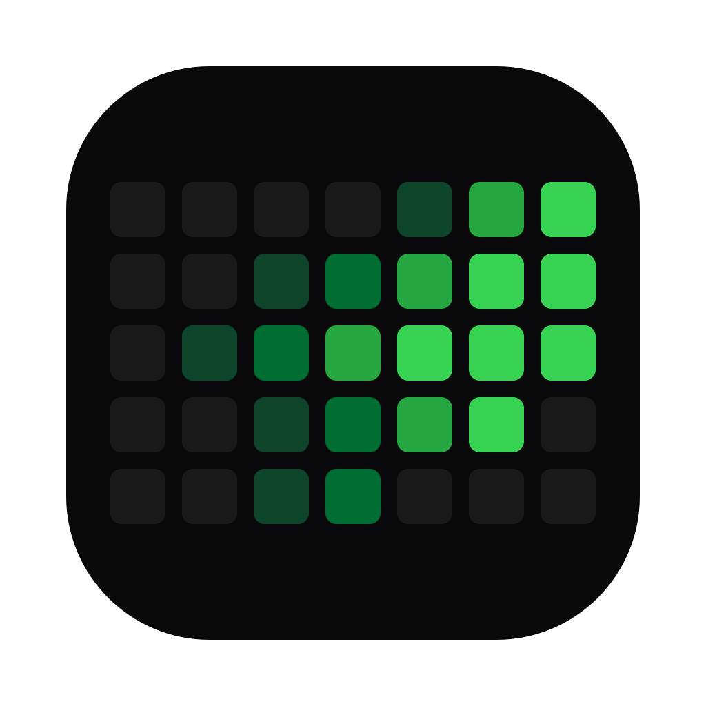

<div align="center">



# ContribKit · App

**The iOS & Android app: render your contribution calendar, customize it, and, on Android, pin it to your home screen as a widget.**

[](https://github.com/fbuireu/contribkit/actions/workflows/ci.yml)
[](https://codecov.io/gh/fbuireu/contribkit)

**[Project overview](../README.md)** · **[Google Play](https://play.google.com/store/apps/details?id=com.fbuireu.contribkit)** · **App Store (soon)** · **[Web docs](../web/README.md)**

</div>

---

## Table of Contents

- [Features](#features)
- [Stack](#stack)
- [Architecture](#architecture)
- [Development](#development)
- [Home-Screen Widgets](#home-screen-widgets)
- [In-App Purchases](#in-app-purchases)
- [Releases](#releases)

---

## Features

- 📱 **Native iOS & Android:** one Flutter codebase; home-screen widgets on Android only
- 🎨 **All 11 palettes & 5 shapes:** palettes are loaded from [`shared/`](../shared); the shapes are a hardcoded `CellShape` enum, because nothing in Dart reads `shapes.json` ([ADR 0002](../docs/adr/0002-shared-design-tokens-mirrored-into-the-flutter-bundle.md))
- 🧿 **Home-screen widgets (Android):** small (streak counter) and medium (grid, streak and total)
- 🔋 **Daily background refresh:** fetches once a day, easy on the battery
- 📤 **Export & share:** PNG, SVG, or Markdown straight into the system share sheet
- 🔓 **No login:** just a username, and only public contribution data

---

## Stack

| Concern             | Choice                                                              |
| ------------------- | -------------------------------------------------------------------- |
| Framework           | Flutter (stable channel)                                            |
| State management    | Riverpod (`riverpod_annotation` codegen)                            |
| Models              | freezed + json_serializable                                         |
| Persistence         | Hive (cache + settings)                                             |
| Widgets & refresh   | `home_widget` + `workmanager`                                       |
| UI primitives       | `shadcn_ui` (wrapped in `AppXxx` widgets) + `flutter_animate`       |
| In-app purchases    | RevenueCat (`purchases_flutter`)                                    |

---

## Architecture

Same DDD-ish layering as the web; each layer documents its rules in a colocated [`CLAUDE.md`](../CLAUDE.md):

| Layer                                                    | Role                                                                  |
| --------------------------------------------------------- | --------------------------------------------------------------------- |
| **[domain](lib/domain/CLAUDE.md)**                       | Pure Dart business core: entities, value objects, typed `Failure`s    |
| **[application](lib/application/CLAUDE.md)**             | One class per use case, dependencies via constructor                  |
| **[infrastructure](lib/infrastructure/CLAUDE.md)**       | GitHub client, Hive persistence, export implementations               |
| **[infrastructure/github/dtos](lib/infrastructure/github/dtos/CLAUDE.md)** | JSON DTOs, converted to entities at the boundary    |
| **[ui](lib/ui/CLAUDE.md)**                               | Widgets + Riverpod providers: the only Flutter-aware layer             |
| **[ui/di](lib/ui/di/CLAUDE.md)**                         | All dependency wiring                                                 |
| **[ui/theme](lib/ui/theme/CLAUDE.md)**                   | Design tokens and semantic colors                                     |

---

## Development

```bash
flutter pub get
```

| Command                                                      | Action                              |
| ------------------------------------------------------------ | ----------------------------------- |
| `flutter run --dart-define-from-file=dart-defines.json`      | Run locally                         |
| `dart run build_runner watch`                                | Watch codegen (riverpod, freezed)   |
| `flutter test --coverage`                                    | Run tests                           |
| `flutter analyze`                                            | Static analysis                     |

`REVENUECAT_KEY` is only needed to exercise the tip jar; the rest of the app runs without it.

Git hooks are repo-wide. See **[Monorepo Development](../README.md#monorepo-development)**.

---

## Home-Screen Widgets

**Android only.** `app/ios` carries the `Runner` and `RunnerTests` targets and nothing else. There is no WidgetKit extension, so an iOS install has no home-screen widget. Two sizes ship:

| Size            | Provider                        | Shows                                                     |
| --------------- | ------------------------------- | --------------------------------------------------------- |
| Small (80×40dp) | `ContribKitSmallWidgetProvider` | Streak counter                                            |
| Medium (250×110dp) | `ContribKitWidgetProvider`   | Username, streak badge, the grid image and the year total |

Widgets render with whatever palette you set in the app and refresh once a day in the background (`workmanager`), so the grid stays current without draining the battery.

---

## In-App Purchases

A simple **tip jar** ($1 / $5 / $10) built with the RevenueCat SDK and a custom Flutter UI (no RevenueCat Paywall builder). Tips are one-time, unlock nothing, and the app is fully functional without them.

---

## Releases

Driven by [`release-app.yml`](../.github/workflows/release-app.yml):

- **Versioning:** semantic-release tags `app-vX.Y.Z` and keeps a moving major tag (`app-vX`).
- **Build:** release AAB signed with the upload keystore (decoded from secrets at build time), minified with R8 (code + resource shrinking).
- **Publish:** fastlane uploads to the selected **Google Play track** (workflow input); `production` uses the `app-production` GitHub Environment, anything else uses `app-development` (internal track + RevenueCat sandbox).
- **Changelogs:** release notes are written to `android/fastlane/metadata/android/en-US/changelogs`.

See the **[root README](../README.md#monorepo-development)** for the environments naming convention shared with the web.
