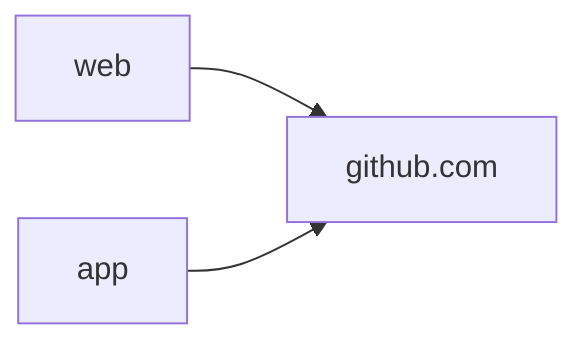
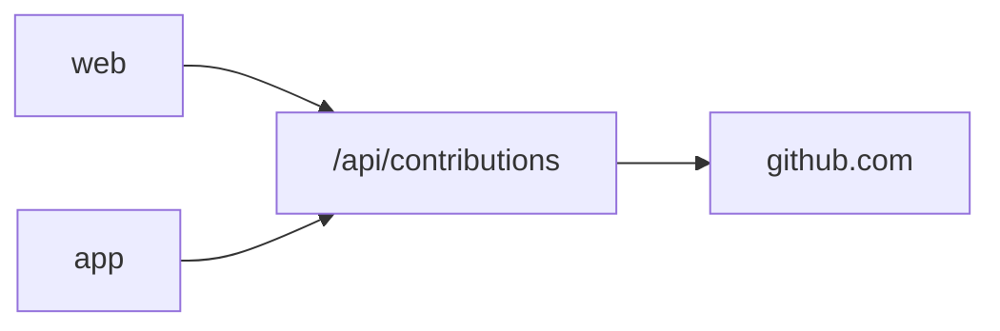

# Plan: point the mobile app at the ContribKit API

Status: deferred by [ADR 0011](../adr/0011-keep-the-apps-own-scraper-for-now.md) until the API rate limit stops keying on the caller's raw IP. This is the execution detail for when that trigger fires; it is not scheduled work. Context in [ADR 0008](../adr/0008-the-mobile-app-fetches-github-directly.md).

## Why

The scraper exists twice. GitHub's markup is the most fragile input in the project, and today a change to it needs two fixes in two languages. And the app's fix reaches users through store review rather than a deploy. Serving the app from `/api/contributions` collapses that to one parser behind one deploy.

## Why it is not a one-line change

Today both clients are independent all the way down:

The target moves the app behind the API, which makes the web deployment a hard dependency of the mobile app:

That trade is the whole decision: one parser instead of two, paid for with an availability and rate-limit coupling that does not exist today.

## Blockers to clear first

1. **Rate limiting.** `/api/*` is limited per client IP ([ADR 0010](../adr/0010-rate-limit-only-the-json-api.md)). Mobile users behind carrier NAT share an address, so a single bucket would throttle unrelated users. The API needs a limit keyed on something other than raw IP before app traffic lands on it.
2. **Shape mismatch.** The API returns a flat `days` array (repeated as the deprecated `cells` alias) with a nullable `count` and no year. The app's `ContributionCalendar` is weeks with a year. Either the API grows a representation the app can consume, or the app converts at its boundary. The `count` half of this has closed ([ADR 0019](../adr/0019-an-unknown-count-is-null-in-both-clients.md) made it nullable on both sides), so what remains is the weeks and the year.
3. **Level parity.** Both read GitHub's `data-level`, so the API carries the authoritative level per day. **It is not full parity**: when the attribute is missing the app derives a level from the Count via `ContributionLevelService` while the web drops the day and lets the grid backfill it, so the same page can yield a different level on each side. `app/lib/infrastructure/CLAUDE.md` keeps that divergence table. Migrating means the app inherits the web's answer, which is a behaviour change for those days, not a no-op.
4. **Offline.** The app caches calendars on device and works without the web being up. Any migration keeps that cache; the API becomes the source, not the availability guarantee.

## Steps

1. Re-key the API rate limit so it is safe for many users behind one address; keep the SVG endpoint as-is.
2. Extend `/api/contributions` to return the calendar grouped into weeks with an explicit year, keeping the current flat response for existing consumers.
3. Add a `ContribKitApiContributionRepository` in the app implementing the existing `ContributionRepository` interface. No domain or UI change: the interface already fits.
4. Put it behind a build-time flag, defaulting to the existing GitHub repository, and ship both.
5. Flip the default in `dart-defines.json` (the non-production config). Compare rendered calendars against the GitHub path for the suggested usernames.
6. Flip production. Keep the GitHub repository in the tree as a fallback for one release.
7. Once the API path has shipped clean, delete the app's scraper, its regexes, and `ContributionLevelService`.

## When to abandon this

If step 1 has no clean answer, stop. Duplicated parsing is a smaller problem than a mobile app that fails for everyone sharing a carrier gateway.
