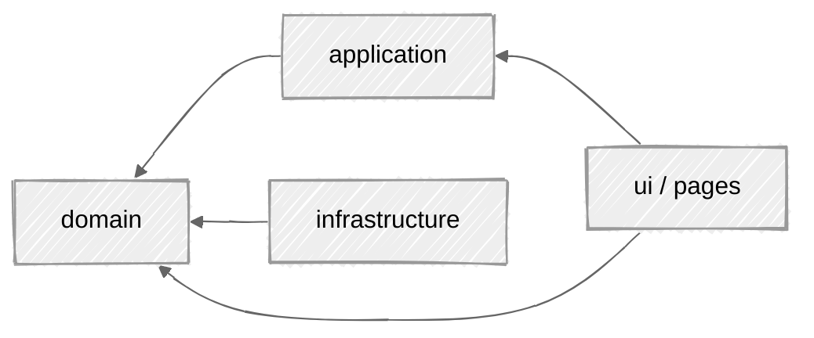

# Architecture

Both the web and mobile apps follow the same DDD-ish layered architecture. The dependency direction is strict: `domain` knows nothing about anything else; everything points inward toward it.

Each layer documents its own rules in a colocated `CLAUDE.md`.

---

## Layers (web)

| Layer | Role |
|-------|------|
| **domain** | Pure business core: value objects, entities, failures, geometry. No Astro, no Cloudflare, no `fetch`. |
| **application** | Curried use cases that orchestrate the domain, plus `Failure` → HTTP mapping. |
| **infrastructure** | GitHub HTML scraping, the SVG string renderer, logging. Implements domain interfaces. |
| **ui** | Astro components, client interactivity, styles. |
| **pages** | Routes, the only layer that wires everything together (the composition root). |

---

## Where the detail lives

This page is the shape, not the rules. Every layer states its own, next to the code, and those guides are what the
maintenance contract keeps honest — a table here was a second copy that nothing checked, and it had gone wrong in
four places at once: the `Failure` union missing `RateLimited`, a curried use case that had been deleted, a
hardcoded default Cell Shape that comes from `shared/shapes.json`, and a `total` rule stated backwards.

| Question | Guide |
|---|---|
| What is a value object here, and how does each one fail? | [`web/src/domain/CLAUDE.md`](https://github.com/fbuireu/ContribKit/blob/main/web/src/domain/CLAUDE.md) · [`app/lib/domain/CLAUDE.md`](https://github.com/fbuireu/ContribKit/blob/main/app/lib/domain/CLAUDE.md) |
| What use cases are there, and what maps a `Failure` to a status? | [`web/src/application/CLAUDE.md`](https://github.com/fbuireu/ContribKit/blob/main/web/src/application/CLAUDE.md) · [`app/lib/application/CLAUDE.md`](https://github.com/fbuireu/ContribKit/blob/main/app/lib/application/CLAUDE.md) |
| How is GitHub scraped, and how is the SVG drawn? | [`web/src/infrastructure/CLAUDE.md`](https://github.com/fbuireu/ContribKit/blob/main/web/src/infrastructure/CLAUDE.md) · [`app/lib/infrastructure/CLAUDE.md`](https://github.com/fbuireu/ContribKit/blob/main/app/lib/infrastructure/CLAUDE.md) |
| What does each error mean to a caller? | **[API Reference](API-Reference)** · **[Troubleshooting](Troubleshooting)** |
| Why are the layers this shape at all? | [ADR 0003](https://github.com/fbuireu/ContribKit/blob/main/docs/adr/0003-layered-domain-architecture-in-both-clients.md) |

Two rules are worth stating here because they hold in both clients and in every layer:

- **Repositories are interfaces in `domain/`,** implemented in `infrastructure/`. A network or parsing error becomes
  a typed failure at that boundary; a raw `Error` never escapes it.
- **Errors are a sealed set, matched without a wildcard.** The web returns them as values, the app throws them
  ([ADR 0004](https://github.com/fbuireu/ContribKit/blob/main/docs/adr/0004-typed-failures-instead-of-thrown-exceptions.md)).

---

## Shared design tokens

Palettes, shapes, and suggested usernames are defined once in `shared/*.json` and consumed by both apps. The web imports them via the `@shared` alias at build time; the Flutter app bundles generated copies under `app/assets/`. See **[Project Structure](Project-Structure)**.

---

## See also

- **[Project Structure](Project-Structure)** shows where each layer lives on disk.
- **[Web Application](Web-Application)** · **[Mobile App](Mobile-App)** cover the per-platform specifics.
