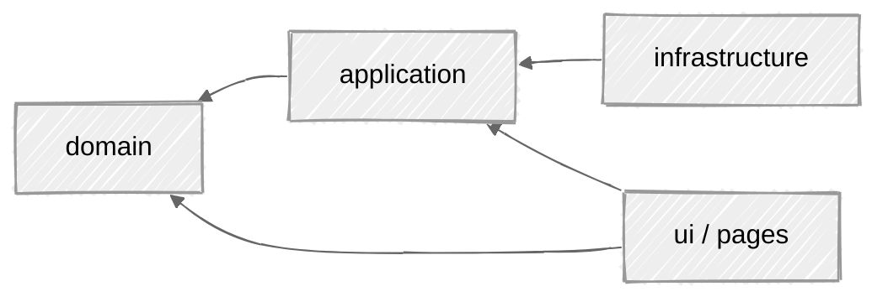

# Architecture

Both the web and mobile apps follow the same DDD-ish layered architecture. The dependency direction is strict: `domain` knows nothing about anything else; everything points inward toward it.

Each layer documents its own rules in a colocated `CONTEXT.md`.

---

## Layers (web)

| Layer | Role |
|-------|------|
| **domain** | Pure business core: value objects, entities, failures, geometry. No Astro, no Cloudflare, no `fetch`. |
| **application** | Curried use cases that orchestrate the domain, plus `Failure` → HTTP mapping. |
| **infrastructure** | GitHub HTML scraping, the SVG string renderer, logging. Implements domain interfaces. |
| **ui** | Astro components, client interactivity, styles. |
| **pages** | Routes — the only layer that wires everything together (the composition root). |

---

## Core principles

### Pure domain

`domain/` imports no packages — only TS stdlib types plus the design-token JSON from `@shared` as data. Functional style: factory functions return readonly objects with a discriminating `_tag`. No classes.

### Validated value objects

Value objects validate on construction. If a `Username` exists, it is valid; same for `Year`, `Palette`, `ShapeKind`, `ContributionLevel`. Validation happens once, at the boundary, so the rest of the code never re-checks. Each exposes a `parse*` constructor returning `T | Failure` (or `null`) and an `is*` type guard.

| Value object | Rule | On failure |
|--------------|------|------------|
| `Username` | trimmed; matches `^[a-zA-Z0-9](?:[a-zA-Z0-9-]{0,37}[a-zA-Z0-9])?$` (1–39 chars, no leading/trailing or doubled hyphen) | `InvalidInput(username)` |
| `Year` | `null`/empty → `null` (latest rolling year); must be an integer in `2005 … currentYear` | `InvalidInput(year)` |
| `ContributionLevel` | `clampLevel(raw)` clamps any number into `0–4` | never fails (clamps) |
| `Palette` | looked up by key; unknown key falls back to `github` | never fails (default) |
| `ShapeKind` | one of `rounded`, `square`, `circle`, `dot`, `hex`; unknown falls back to `rounded` | never fails (default) |

`Username` and `ShapeKind`/`Palette` source their suggestion lists and definitions from the shared token JSON, so input validation and the customizer stay in sync.

### Entities

| Entity | Shape |
|--------|-------|
| `ContributionDay` | `{ date: string; level: 0–4; count: number \| null }` |
| `ContributionCalendar` | `{ username: string; days: ContributionDay[]; total: number \| null }` |

A day's `count` is `null` when GitHub exposes no tooltip for it; `total` is `null` when no counts were found at all.

### Domain services

Pure helpers with no I/O, all unit-tested:

| Service | Responsibility |
|---------|----------------|
| `calendar-grid` | builds the deterministic 53×7 grid — see **[Calendar Grid](Calendar-Grid)** |
| `svg-geometry` | layout constants, dimensions, week/month-label positioning, hex points |
| `cell-shapes` | per-shape SVG cell markup shared by server and client renderers |
| `dates` | ISO-string date math (`addDays`, `getWeekday`, `toIsoDate`) |
| `SvgRenderer` | the pure rendering **function type** implemented in `infrastructure/` |

### Typed failures, no throwing

Errors are a `Failure` discriminated union — `NotFound`, `InvalidInput`, `Network`, `Parse`. Functions return `T | Failure`; nothing throws across layers. Failures are built with small constructors and narrowed with `isFailure`:

| Constructor | Produces | Carries |
|-------------|----------|---------|
| `notFound(username)` | `NotFound` | `username` |
| `invalidInput({ field, message })` | `InvalidInput` | `field` (`username`/`year`), `message` |
| `network(message, status?)` | `Network` | `message`, optional upstream `status` |
| `parse(message)` | `Parse` | `message` |

The mapping from `Failure` to an HTTP status and message lives in exactly one place: `application/http/failure-http.ts` (`statusFor`, `messageFor`), guarded by `isFailure`. See **[How It Works](How-It-Works)** for the status table.

### Curried use cases

Use cases are curried factory functions: they take repository/service implementations and return the operation. They hold no state and know nothing about Astro, Cloudflare, or `fetch` — everything arrives via the closure.

| Use case | Purpose |
|----------|---------|
| `fetchContributions(repo)({ username, year })` | Loads a `ContributionCalendar` for a user/year |
| `renderCalendarSvg(renderer)({ calendar, options })` | Renders the SVG string for a calendar |
| `loadInitialContributions(load)({ username?, year? })` | Validates input, loads, and returns the built 53×7 grid |

### Repositories are interfaces

`domain/repositories/` declares interfaces only. Implementations live in `infrastructure/` — e.g. `createGithubHtmlContributionsRepository`. Network and parsing errors are converted to `Failure` at that boundary; a raw `Error` never escapes.

---

## Shared design tokens

Palettes, shapes, and suggested usernames are defined once in `shared/*.json` and consumed by both apps. The web imports them via the `@shared` alias at build time; the Flutter app bundles generated copies under `app/assets/`. See **[Project Structure](Project-Structure)**.

---

## See also

- **[Project Structure](Project-Structure)** — where each layer lives on disk
- **[Web Application](Web-Application)** · **[Mobile App](Mobile-App)** — per-platform specifics
