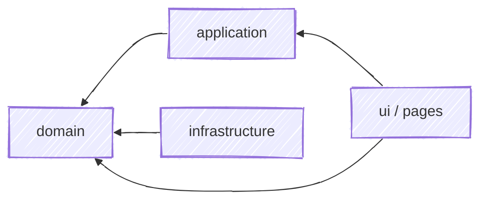

# Architecture

Both the web and mobile apps follow the same DDD-ish layered architecture. The `-ish` is deliberate and defined: the layers, the vocabulary, the ports and the typed failures are non-negotiable, while the tactical patterns are applied only where they pay, so the code does not carry abstractions nothing reads. [ADR 0025](https://github.com/fbuireu/contribKit/blob/main/docs/adr/0025-how-much-ddd-and-where-it-stops.md) states the test and the calls it produced. The dependency direction is strict: `domain` knows nothing about anything else; everything points inward toward it.

```mermaid
---
config:
  look: handDrawn
  layout: dagre
---
flowchart RL
    application --> domain
    infrastructure --> domain
    ui["ui / pages"] --> application
    ui --> domain
```

The rules the code is reviewed against are in [`CODING_STANDARDS.md`](https://github.com/fbuireu/contribKit/blob/main/CODING_STANDARDS.md); each layer's colocated `AGENTS.md` holds what an implementer working there needs.

---

## Layers (web)

| Layer | Role |
|-------|------|
| **domain** | Pure business core: value objects, entities, failures, geometry. No Astro, no Cloudflare, no `fetch`. |
| **application** | Curried use cases that orchestrate the domain, plus `Failure` → HTTP mapping. |
| **infrastructure** | GitHub HTML scraping, the SVG string renderer, logging. Implements domain interfaces. |
| **ui** | Astro components, client interactivity, styles. |
| **pages** | Routes, the only layer that wires everything together (the composition root). |

---

## Where the detail lives

This page is the shape, not the rules. The rules are in
[`CODING_STANDARDS.md`](https://github.com/fbuireu/contribKit/blob/main/CODING_STANDARDS.md) and each layer's guide
sits next to its code; the docs-consistency test holds both to the tree, and nothing would check a copy here.

| Question | Guide |
|---|---|
| What is a value object here, and how does each one fail? | [`web/src/domain/AGENTS.md`](https://github.com/fbuireu/ContribKit/blob/main/web/src/domain/AGENTS.md) · [`app/lib/domain/AGENTS.md`](https://github.com/fbuireu/ContribKit/blob/main/app/lib/domain/AGENTS.md) |
| What use cases are there, and what maps a `Failure` to a status? | [`web/src/application/AGENTS.md`](https://github.com/fbuireu/ContribKit/blob/main/web/src/application/AGENTS.md) · [`app/lib/application/AGENTS.md`](https://github.com/fbuireu/ContribKit/blob/main/app/lib/application/AGENTS.md) |
| How is GitHub scraped, and how is the SVG drawn? | [`web/src/infrastructure/AGENTS.md`](https://github.com/fbuireu/ContribKit/blob/main/web/src/infrastructure/AGENTS.md) · [`app/lib/infrastructure/AGENTS.md`](https://github.com/fbuireu/ContribKit/blob/main/app/lib/infrastructure/AGENTS.md) |
| What does each error mean to a caller? | **[API Reference](API-Reference)** · **[Troubleshooting](Troubleshooting)** |
| Why are the layers this shape at all? | [ADR 0003](https://github.com/fbuireu/ContribKit/blob/main/docs/adr/0003-layered-domain-architecture-in-both-clients.md) |

Two of those rules shape every layer in both clients: repositories are interfaces in `domain/` that
`infrastructure/` implements, and failures are a sealed set matched without a wildcard, which the web returns as
values and the app throws
([ADR 0004](https://github.com/fbuireu/ContribKit/blob/main/docs/adr/0004-typed-failures-instead-of-thrown-exceptions.md)).

---

## Shared design tokens

Palettes, shapes, and suggested usernames are defined once in `shared/*.json` and consumed by both apps. The web imports them via the `@shared` alias at build time; the Flutter app bundles generated copies under [`app/assets/`](https://github.com/fbuireu/contribKit/tree/main/app/assets). See **[Project Structure](Project-Structure)**.

---

## See also

- **[Project Structure](Project-Structure)** shows where each layer lives on disk.
- **[Web Application](Web-Application)** · **[Mobile App](Mobile-App)** cover the per-platform specifics.
