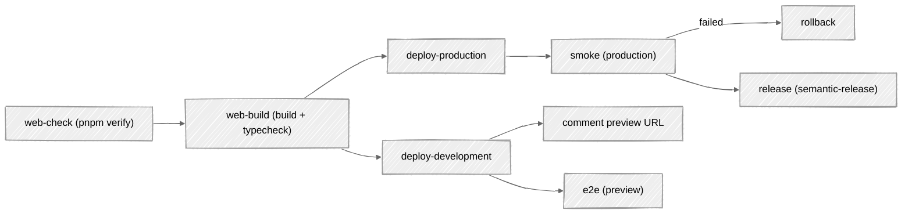
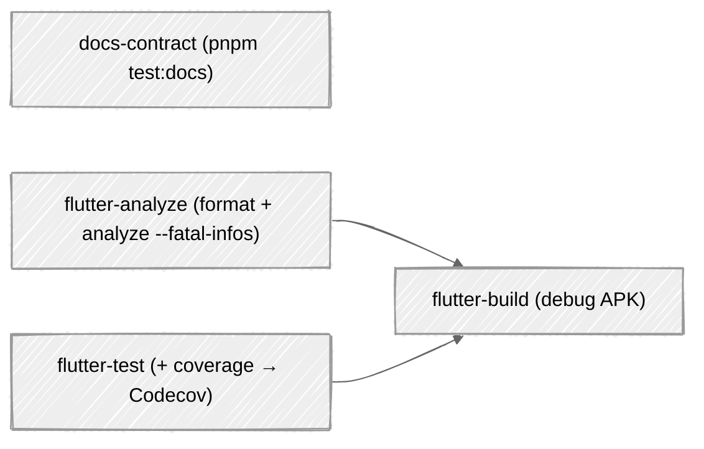
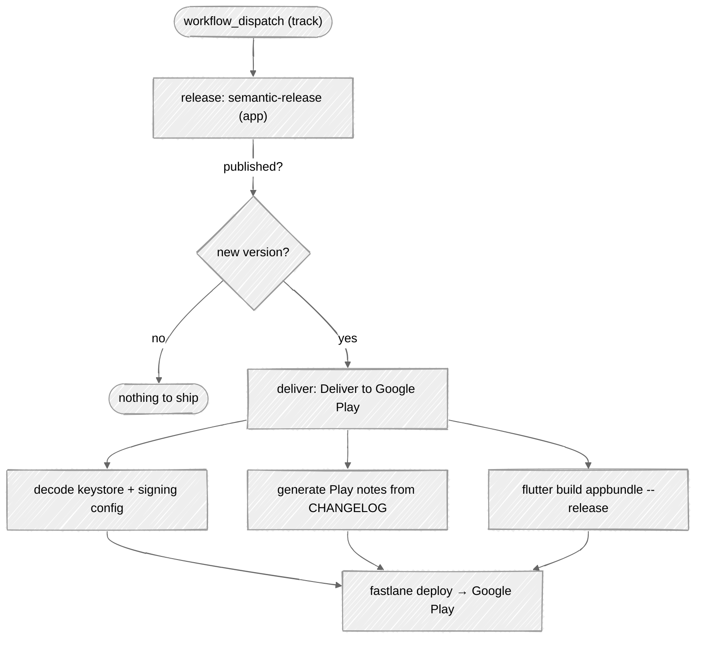

# CI/CD

CI is one workflow with **no path filter**, and a `changes` job that gates each per-component job with `if:`, so an app change never triggers a web build and vice versa.

> **Path filters used to be where guards died here.** The CI was two workflows filtered by `paths:`, so every
> guard had to be paired with the question of which filter carried the files it read, and that was answered wrong
> three times: the app side, the preview-Worker cleanup, and `scripts/**` plus the root [`package.json`](../../package.json), whose
> comments and version pins the contract asserts while no workflow watched them. A fourth copy of the filter had
> drifted and left preview Workers alive. There is one [`ci.yml`](../../.github/workflows/ci.yml) now with **no path filter**, and a `changes` job
> that gates jobs with `if:` instead. Each component is linted, tested, built, versioned with semantic-release,
> and shipped: the web to Cloudflare, the app to Google Play. Workflows live in [`.github/workflows/`](../../.github/workflows).

| Workflow | Triggers on | Does |
|----------|-------------|------|
| `ci.yml` | every push and PR to `main`, plus manual dispatch — the dispatch redeploys production, the tail Worker and the smoke run behind them, and cuts no release: secrets ride the deploy and the build inlines the public env, so a rotated credential reaches nothing until something redeploys | a `changes` job diffs the range and exposes `app`, `web` and `cross_package`; everything else is gated on it. Docs contract, the two per-client workflows, then deploy, the preview comment, the preview e2e, the production smoke run and the release. A final `Check` job aggregates them all |
| [`_ci-app.yml`](../../.github/workflows/_ci-app.yml) | reusable, called by `ci.yml` | Flutter format check, analyze, test with coverage, debug APK. Its jobs show as `App / Analyze`, `App / Test`, `App / Build`, and none of them can be a required check: see `Check` below |
| [`_ci-web.yml`](../../.github/workflows/_ci-web.yml) | reusable, called by `ci.yml` | lint, format check, test with coverage, build, typecheck. Its jobs show as `Web / Check`, `Web / Build` |
| [`_deploy.yml`](../../.github/workflows/_deploy.yml) | reusable | shared web deploy steps. Takes the GitHub Environment (`web-production` / `web-development`) and derives `CLOUDFLARE_ENV` from it by stripping the `<component>-` prefix |
| [`release-app.yml`](../../.github/workflows/release-app.yml) | manual (`workflow_dispatch`) | semantic-release **+ automatic Google Play delivery** |
| [`cleanup-development.yml`](../../.github/workflows/cleanup-development.yml) | PR close | deletes the per-PR preview worker |
| [`dependency-review.yml`](../../.github/workflows/dependency-review.yml) | every PR | fails a PR that introduces a dependency with a known vulnerability |
| [`dependabot-auto-merge.yml`](../../.github/workflows/dependabot-auto-merge.yml), [`renovate-auto-approve.yml`](../../.github/workflows/renovate-auto-approve.yml) | dependency PRs | automated dependency updates |
| [`sync-wiki.yml`](../../.github/workflows/sync-wiki.yml) | push to `main` under `docs/wiki/**` | publishes this wiki |
| [`commit-message.yml`](../../.github/workflows/commit-message.yml) | PR opened / edited | commitlint on the PR title: the message a squash-merge actually commits |
| [`zizmor.yml`](../../.github/workflows/zizmor.yml) | push / PR | GitHub Actions security linting |

---

## Web pipeline (`_ci-web.yml`, plus the deploy and release jobs in `ci.yml`)

- **web-check:** one `pnpm verify`, covering `format:check` (Biome, no writes), `typecheck`, `lint:astro` and the Vitest coverage run; then upload coverage to Codecov. The same command runs on `pre-push`, so a green push is a green check.

`lint:astro` is inside `verify` because `tsc --noEmit` does not typecheck `.astro` files: only `astro check` does. It used to run solely in `web-build`, so a type error in a component's props passed `verify`, passed `pre-push`, and failed a later CI job. A prop typed `readonly string[]` that started receiving a value object is exactly how that was found.
- **web-build:** production build + `pnpm lint:astro` (`astro check` over the Astro diagnostics). No workflow runs `tsc`; `pnpm lint:ts:typecheck` is a local command only.
- **deploy-tail:** on push to `main` or a manual dispatch, deploys `web/workers/tail/`, the `contribkit-tail` Worker that both `[env.*.tail_consumers]` entries name. `deploy-production` needs it, so the reference is always resolvable; nothing deployed it from CI before.
- **deploy-production:** on push to `main`, build with `CLOUDFLARE_ENV=production`, then `wrangler deploy --env production` → worker `contribkit` on `contribkit.app`. The `--env` is load-bearing and was missing until 2026-08-28: without it wrangler ships the top level of `wrangler.toml`, which declares no routes, no rate limiter, no observability, no placement and no tail consumer.
- **deploy-development:** on PRs, build with `CLOUDFLARE_ENV=development`, deploy an ephemeral worker `pr-<n>-contribkit-development` on `*.workers.dev`; a bot comment posts the preview URL; the worker is removed on PR close by `cleanup-development.yml`, which carries no path filter at all, so no preview can outlive its pull request.
- **smoke:** on push to `main`, the only job that ever requests `https://contribkit.app`. It runs the four cases tagged `@smoke`, all of them in `web/e2e/smoke.spec.ts`, against production: the homepage with a non-empty title, an unknown path answering 404, `robots.txt`, and `/user/<name>.svg` returning an SVG. The first three are the set every sibling repository runs, so a difference between them is drift; the fourth is this repository's own, and earns its place because that route cannot be prerendered and is therefore the one that proves the Worker is running rather than serving assets. `/api/health` was a fourth until production answered it with an HTML document while a browser got the expected JSON; the root guide records why that points at a zone rule rather than at the Worker. The grep carries no `--pass-with-no-tests`: Playwright exits 1 on an empty set, so a tag that stops matching fails the job instead of passing vacuously.
- **rollback:** on push to `main`, runs `wrangler rollback --env production` when the deploy succeeded and `smoke` failed, so a version that does not answer stops serving rather than merely going untagged. It is a separate job because it needs the Cloudflare credentials `smoke` deliberately does without.
- **release:** semantic-release versions the web component. It needs `deploy-production` **and** `smoke`, so a `web-v*` tag means the version is live and answering. It used to need only `web-ci`, which meant the tag, the GitHub release and the changelog entry could all be published for a version whose deploy had just failed, and `workflow_dispatch` could cut one without deploying at all; that trigger is gone from its condition for the same reason.

Both deploys pass an explicit `--message` (`<sha> - <event>`) to `wrangler deploy`. Without it, wrangler
annotates the deployment with the full commit message, and Cloudflare rejects the deploy when that message
is very long (e.g. a large squash-merge body). The API error does not mention the message at all.

Concurrency cancels in-progress runs for pull requests only.

> **The path filter is wider than `web/**` on purpose.** `shared/**`, `docs/**` and `*.md` are in the trigger list because the documentation-consistency contract runs inside `web-check`, and a guard that never fires on documentation changes is not a guard. The cost is that `deploy-production` sits behind the same filter, so **a documentation-only push to `main` redeploys the Worker**. That is accepted: the deploy is idempotent, and the alternative is a silently disabled contract. Removing any of those three patterns disables it.

---

**Both `astro build` steps are retried, three attempts with a 15-second wait**: the one in `_ci-web.yml` and the one
in `_deploy.yml`. Astro's font provider downloads Inter and JetBrains Mono from Google at build time, and Google
intermittently hands out a `fonts.gstatic.com` URL that then 404s, which fails the build with `CannotFetchFontFile`.
**Each attempt deletes `node_modules/.astro/fonts` first, and that is the part that makes the retry work at all.**
Astro caches the resolved URLs there, so a plain retry re-reads the dead one. A run on `338e6e3` failed three
times on the identical URL before the cache was cleared between attempts. They are `uses:` steps that `cd web`,
because a step running an action does not inherit the job's `working-directory`.

## App pipeline (`_ci-app.yml`)

Runs on every `app/**` change:

- **docs-contract:** installs Node and the web dependencies and runs `pnpm test:docs`. It touches no Dart, and it lives in `ci.yml` ungated rather than in either per-client workflow, because a large share of its assertions are about the Flutter side and the rest are about the repository root.
- **flutter-analyze:** `dart format` verification + `flutter analyze --fatal-infos`.
- **flutter-test:** unit/widget tests with coverage uploaded to Codecov.
- **flutter-build:** builds a debug APK to catch build breakages early.

**The e2e suite runs against a deployed preview Worker in CI, and against a local one everywhere else.** `BASE_URL`
points the run at `pr-<n>-contribkit-development.workers.dev`, which is the only place the Workers runtime is real:
the rate-limiter binding, the security headers and the SVG route's `Cross-Origin-Resource-Policy` exemption do not
exist in a plain Astro dev server. With `BASE_URL` unset, Playwright's `webServer` starts `pnpm wrangler:dev` on
`localhost:8787` instead, so `pnpm test:e2e` works on a laptop. That fallback used to be declared in `baseURL` and
wired to nothing, so a local run pointed at an empty port.

Both `flutter analyze --fatal-infos` and `flutter test` also run on `pre-push`, so a green push is a green check on the app side too. The hook used to run the analysis alone, which left the app's thinnest-covered layers as the only ones no local gate exercised.

Coverage thresholds live in [`.github/codecov.yml`](https://github.com/fbuireu/contribKit/blob/main/.github/codecov.yml): the project status allows a 1% drop against the base, and a patch must reach 80%. That file used to declare `ignore` and nothing else, so enforcement rested on Codecov's undeclared defaults and the bar could be moved from a web UI without leaving a trace in the tree.

---

Every network-bound step in the app pipeline is cached: the Flutter SDK by `flutter-action`, pub by `~/.pub-cache`
keyed on `pubspec.lock`, and Gradle by `~/.gradle/caches` keyed on the Gradle files. **Nothing here is retried, on
purpose**: the failures this pipeline has actually seen were dependency resolution on a Renovate branch, which a
retry would only have made slower to report.

## Automatic Google Play delivery (`release-app.yml`)

The fancy part. Triggered manually with a **track** choice (`internal` / `alpha` / `beta` / `production`), it versions *and ships* the Android app end-to-end:

1. **Version:** semantic-release computes the next version from Conventional Commits, updates the changelog, tags `app-vX.Y.Z`, and force-updates the major tag (`app-vX`). A `detect` step decides whether anything was actually published.
2. **Sign:** the upload keystore and Play service-account JSON are decoded from GitHub secrets at runtime; nothing sensitive is committed.
3. **Release notes:** the latest `CHANGELOG.md` section is transformed into a Google Play `changelogs/<versionCode>.txt`: drop the version header, flatten subheadings, unwrap Markdown links, strip bold/commit-hashes, bulletize, drop the commit-scope prefix from each bullet (the store page already names the app), and clamp to **500 chars** (Play's limit) on whole bullets. A bullet that does not fit is dropped entirely, never cut mid-word. The notes are also echoed to the job summary and uploaded as a `play-release-notes-<version>` build artifact on the run. Play indexes changelogs by version code, so the file is named `32.txt` and not `1.3.2.txt`; every place the workflow names that release for a human (the job title, the artifact, the log line, the summary heading) says the version instead, because the version is what the store listing shows.
4. **Build:** `flutter build appbundle --release --dart-define-from-file=dart-defines.json`, where that file is written at runtime from the RevenueCat secret. The `release` build type runs R8 (code shrinking plus resource shrinking), so the AAB Play receives is minified; only the Java/Kotlin side is affected, the Dart code being AOT-compiled already. The workflow does not run `pnpm sync:assets`, but it does regenerate the mirror: a `Sync shared assets` step copies `shared/*.json` into `assets/` immediately before the build, so the AAB always ships the current tokens even if the commit did not.
5. **Upload:** `fastlane deploy track:<track>` pushes the AAB to the chosen Play track.

The job binds to the `app-production` or `app-development` GitHub Environment depending on the selected track, so production secrets stay scoped.

---

## GitHub Environments

Environments are repo-global, so they're namespaced by component (`<component>-<stage>`) and hold component-specific secrets:

| Environment | Component | Stage | Deployed by |
|-------------|-----------|-------|-------------|
| `web-production` | Astro web | production | `ci.yml` (push to `main`) |
| `web-development` | Astro web | development | `ci.yml` (per-PR preview) |
| `app-production` | Flutter app | production | `release-app.yml` (track = production) |
| `app-development` | Flutter app | development | `release-app.yml` (track ≠ production) |

App `development` is the internal Play track + RevenueCat sandbox; web `development` is a per-PR preview Worker. Component-scoped configs don't repeat the prefix: wrangler uses `[env.production]` / `[env.development]`; Flutter has no build flavors: locally the stage is whichever dart-defines file you pass (`dart-defines.prod.json` vs `dart-defines.json`), and in `release-app.yml` it is the `track` input, which selects the GitHub Environment whose `REVENUECAT_KEY` is written into `dart-defines.json` at build time.

---

## Releases & versioning

semantic-release runs per component and tags `web-vX.Y.Z` / `app-vX.Y.Z`, driven by Conventional Commits (enforced by commitlint, see **[Git Hooks](Git-Hooks)**). A pull request that touches both `web/` and `app/` is listed in both changelogs, which is correct when the change genuinely spans both clients, so the `cross-package-notice` job comments on it rather than blocking the merge. Web deploys are decoupled from versioning (production deploys on every qualifying push to `main`); the app's Play delivery is gated on a real semantic-release publish.

---

## Hardening & automation worth noting

- **Pinned actions:** every `uses:` is pinned to a full commit SHA, not a floating tag.
- **Least privilege:** workflows declare minimal `permissions`; `release-app.yml` starts from `permissions: {}` and grants per-job.
- **zizmor:** static security analysis of the workflows themselves.
- **Secrets never touch disk in the repo:** keystore and service-account JSON are base64/secret-decoded into `$RUNNER_TEMP` at runtime.
- **Dependency autopilot:** Dependabot and Renovate PRs are auto-approved/merged once green; pnpm enforces a `minimumReleaseAge` cooldown before pulling new versions.
- **Concurrency is declared three times, for three different races.** `ci.yml` cancels a superseded pull-request
  run and never cancels one on `main`; `_deploy.yml` groups on the Environment and the Worker name with
  `cancel-in-progress: false`, so two deploys aimed at one Worker queue rather than interleave; and
  `cleanup-development.yml` joins `ci.yml`'s group so a preview Worker is never deleted out from under the
  `E2E (preview)` job still driving it. That last group is a literal, and it has to equal `ci.yml`'s `name:`,
  which is `CI`. It said `CI Web` until 2026-08-28, and `CI Web` is `_ci-web.yml`'s name: `github.workflow`
  inside a reusable workflow resolves to the **caller's** name, so no run has ever occupied a group called
  `CI Web-…` and the cleanup queued behind nothing at all.

---

## See also

- **[Git Hooks](Git-Hooks)** runs the same checks locally before push.
- **[Web Application](Web-Application)** explains the `@astrojs/cloudflare` deploy gotcha.
- **[Mobile App](Mobile-App)** covers build configuration, signing, and the Tip Jar.
- **[Project Structure](Project-Structure)** covers the monorepo tooling.
