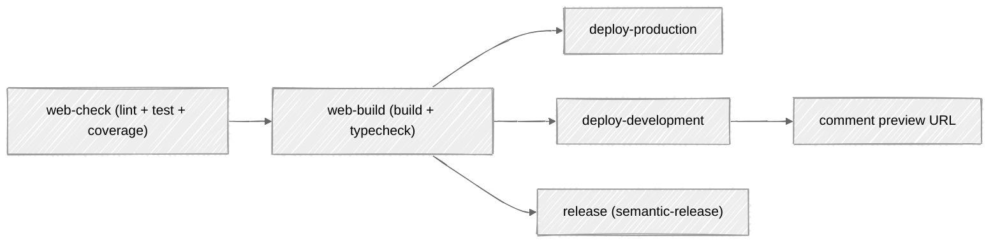
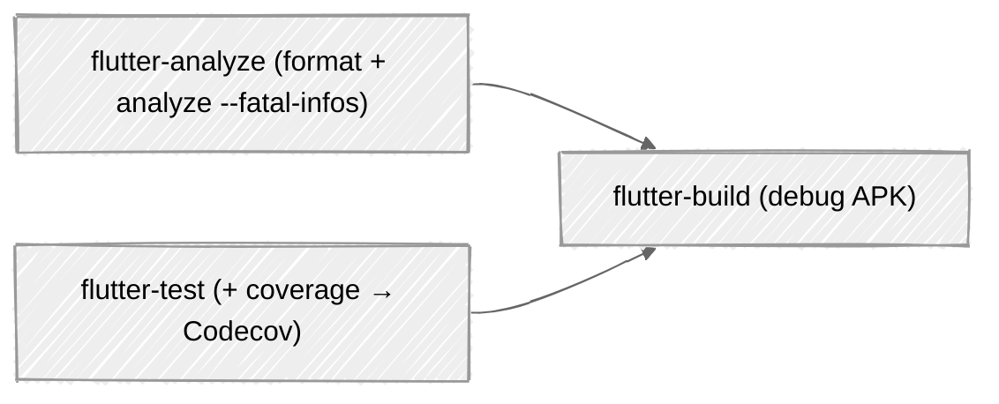
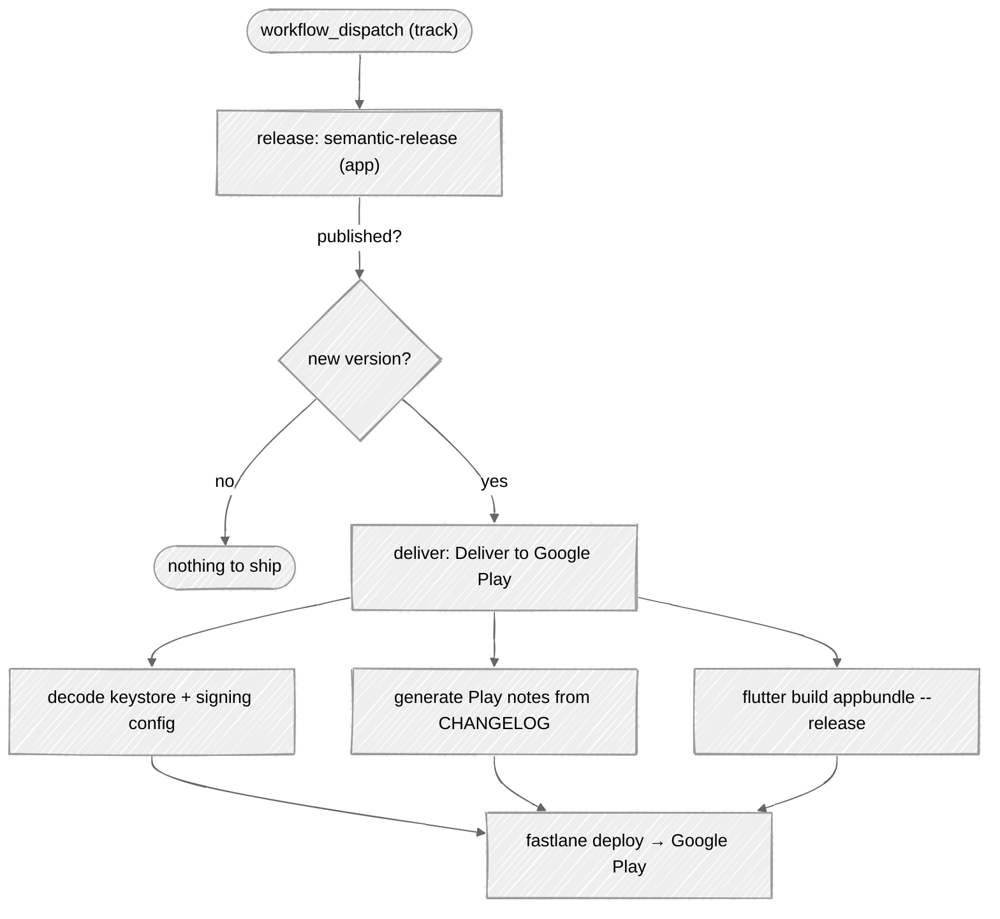

# CI/CD

CI is split per component with **path filters**, so a web change never triggers an app build and vice versa. Each component is linted, tested, built, versioned with semantic-release, and shipped automatically: the web to Cloudflare, the app to Google Play. Workflows live in `.github/workflows/`.

| Workflow | Triggers on | Does |
|----------|-------------|------|
| `ci-web.yml` | `web/**` changes | lint, test, build, typecheck, deploy, release |
| `ci-app.yml` | `app/**` changes | Flutter format check, analyze, test (+coverage), build |
| `release-app.yml` | manual (`workflow_dispatch`) | semantic-release **+ automatic Google Play delivery** |
| `_deploy-web.yml` | reusable | shared web deploy steps |
| `cleanup-web-development.yml` | PR close | deletes the per-PR preview worker |
| `dependabot-auto-merge.yml`, `renovate-auto-approve.yml` | dependency PRs | automated dependency updates |
| `zizmor.yml` | push / PR | GitHub Actions security linting |

---

## Web pipeline (`ci-web.yml`)

- **web-check:** Biome lint, Vitest tests, upload coverage to Codecov.
- **web-build:** production build + `tsc` typecheck.
- **deploy-production:** on push to `main`, build with `CLOUDFLARE_ENV=production`, then `wrangler deploy` → worker `contribkit` on `contribkit.app`.
- **deploy-development:** on PRs, build with `CLOUDFLARE_ENV=development`, deploy an ephemeral worker `pr-<n>-contribkit-development` on `*.workers.dev`; a bot comment posts the preview URL; the worker is removed on PR close by `cleanup-web-development.yml`.
- **release:** semantic-release versions the web component (decoupled from deploy).

Concurrency cancels in-progress runs for pull requests only.

---

## App pipeline (`ci-app.yml`)

Runs on every `app/**` change:

- **flutter-analyze:** `dart format` verification + `flutter analyze --fatal-infos`.
- **flutter-test:** unit/widget tests with coverage uploaded to Codecov.
- **flutter-build:** builds a debug APK to catch build breakages early.

---

## Automatic Google Play delivery (`release-app.yml`)

The fancy part. Triggered manually with a **track** choice (`internal` / `alpha` / `beta` / `production`), it versions *and ships* the Android app end-to-end:

1. **Version:** semantic-release computes the next version from Conventional Commits, updates the changelog, tags `app-vX.Y.Z`, and force-updates the major tag (`app-vX`). A `detect` step decides whether anything was actually published.
2. **Sign:** the upload keystore and Play service-account JSON are decoded from GitHub secrets at runtime; nothing sensitive is committed.
3. **Release notes:** the latest `CHANGELOG.md` section is transformed into a Google Play `changelogs/<versionCode>.txt`: drop the version header, flatten subheadings, unwrap Markdown links, strip bold/commit-hashes, bulletize, and clamp to **500 chars** (Play's limit). The notes are also echoed to the job summary.
4. **Build:** `flutter build appbundle --release`, with the RevenueCat key injected via `--dart-define-from-file` and shared assets synced first.
5. **Upload:** `fastlane deploy track:<track>` pushes the AAB to the chosen Play track.

The job binds to the `app-production` or `app-development` GitHub Environment depending on the selected track, so production secrets stay scoped.

---

## GitHub Environments

Environments are repo-global, so they're namespaced by component (`<component>-<stage>`) and hold component-specific secrets:

| Environment | Component | Stage | Deployed by |
|-------------|-----------|-------|-------------|
| `web-production` | Astro web | production | `ci-web.yml` (push to `main`) |
| `web-development` | Astro web | development | `ci-web.yml` (per-PR preview) |
| `app-production` | Flutter app | production | `release-app.yml` (track = production) |
| `app-development` | Flutter app | development | `release-app.yml` (track ≠ production) |

App `development` is the internal Play track + RevenueCat sandbox; web `development` is a per-PR preview Worker. Component-scoped configs don't repeat the prefix: wrangler uses `[env.production]` / `[env.development]`; Flutter uses `production` / `development` flavors.

---

## Releases & versioning

semantic-release runs per component and tags `web-vX.Y.Z` / `app-vX.Y.Z`, driven by Conventional Commits (enforced by commitlint, see **[Git Hooks](Git-Hooks)**). To keep per-package changelogs clean, the `auto-scope` hook blocks any commit that touches both `web/` and `app/`. Web deploys are decoupled from versioning (production deploys on every qualifying push to `main`); the app's Play delivery is gated on a real semantic-release publish.

---

## Hardening & automation worth noting

- **Pinned actions:** every `uses:` is pinned to a full commit SHA, not a floating tag.
- **Least privilege:** workflows declare minimal `permissions`; `release-app.yml` starts from `permissions: {}` and grants per-job.
- **zizmor:** static security analysis of the workflows themselves.
- **Secrets never touch disk in the repo:** keystore and service-account JSON are base64/secret-decoded into `$RUNNER_TEMP` at runtime.
- **Dependency autopilot:** Dependabot and Renovate PRs are auto-approved/merged once green; pnpm enforces a `minimumReleaseAge` cooldown before pulling new versions.
- **Path-filtered, cancel-in-progress** concurrency keeps runs fast and cheap.

---

## See also

- **[Git Hooks](Git-Hooks)** runs the same checks locally before push.
- **[Web Application](Web-Application)** explains the `@astrojs/cloudflare` deploy gotcha.
- **[Mobile App](Mobile-App)** covers flavors, signing, and in-app purchases.
- **[Project Structure](Project-Structure)** covers the monorepo tooling.
