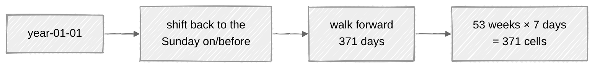
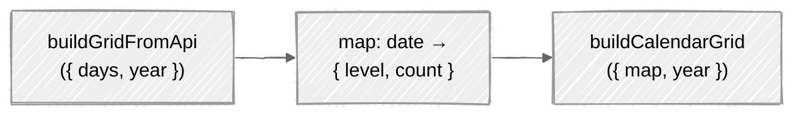

# Calendar Grid

GitHub's contribution calendar is always a fixed **53 weeks × 7 days** grid. ContribKit builds that grid deterministically so rendering is stable regardless of which days GitHub actually returned. The logic lives in `web/src/domain/services/calendar-grid.ts`.



`GRID_CELL_COUNT = WEEKS_PER_YEAR (53) × DAYS_PER_WEEK (7) = 371` cells. All three are declared in `web/src/domain/services/dates.ts`.

---

## Aligning to week boundaries

A year doesn't start on a Sunday, so the grid starts on the **Sunday on or before** January 1st of the target year:

```
start = (year-01-01) shifted back by getWeekday(year-01-01) days
```

From `start`, it walks forward exactly `GRID_CELL_COUNT` days, producing one `ContributionDay` per cell. Date math is pure ISO-string arithmetic in `web/src/domain/services/dates.ts`:

| Helper | Behavior |
|--------|----------|
| `getWeekday(iso)` | `0`–`6` (Sun–Sat) via `Date.getDay()` |
| `addDays({ iso, days })` | shifts an ISO date by N days |
| `toIsoDate(date)` | `YYYY-MM-DD` slice |

The two that construct a date — `getWeekday` and `addDays` — do it at **`T12:00:00`** (local noon) rather than midnight; `toIsoDate` builds no `Date` at all, it formats one out of its local calendar fields. Anchoring at noon avoids off-by-one errors where a DST transition or timezone offset would otherwise push a midnight timestamp into the previous/next day.

### Worked example

`2024-01-01` is a Monday, so `getWeekday("2024-01-01") === 1`. The grid starts one day earlier, on Sunday `2023-12-31`, then walks 371 days forward to fill 53 full weeks. Days that fall outside 2024 (the trailing Sunday of 2023, the leading days of 2025) simply have no entry in the map and render as level 0.

---

## Filling cells

Parsed days are first turned into a lookup map keyed by ISO date:



For each of the 371 positions:

- look up the date in the map,
- if present, use its `level` (run through `clampLevel`) and `count`,
- if absent, emit `{ level: 0, count: null }`.

This guarantees a complete, gap-free grid even when GitHub omits leading/trailing days outside the year.

---

## Why deterministic matters

Because the grid is derived purely from the date and the parsed map, the same input always yields the same output. That keeps SVG rendering reproducible and cacheable, and makes the grid trivially unit-testable. (Placeholder/skeleton grids in the UI use a seeded PRNG for the same reason; see **[Deterministic Randomness](Mulberry32)**.)

---

## See also

- **[HTML Parsing](HTML-Parsing)** produces the days fed into the grid.
- **[SVG Rendering](SVG-Rendering)** chunks the grid back into weeks to draw it.
