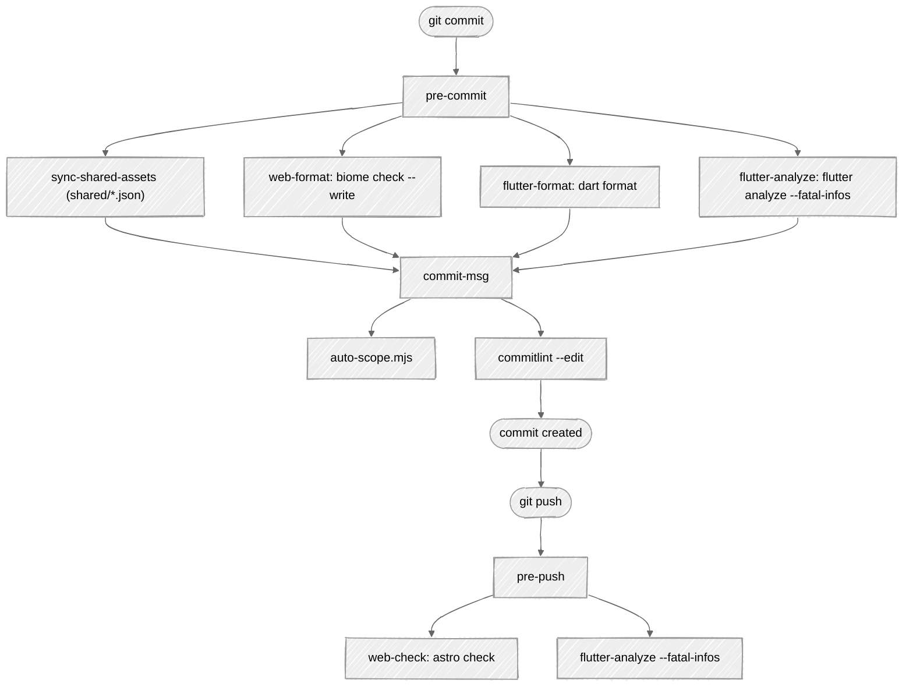

# Git Hooks

ContribKit uses [lefthook](https://github.com/evilmartians/lefthook) to run formatting, linting, analysis, and commit-message checks locally before code ever reaches CI. The config is split per component and composed at the root, so the same hooks work whether you touch `web/`, `app/`, or `shared/`.

---

## Installation

lefthook is a root devDependency and the root `prepare` script runs `lefthook install`, so `pnpm install` wires up the Git hooks on every fresh clone — there is nothing to install by hand. The build script is allow-listed in `pnpm-workspace.yaml` (`allowBuilds.lefthook`), which the binary download needs.

```bash
pnpm install   # hooks are wired as part of it
```

If the hooks ever go missing (say, after re-cloning without installing), `pnpm exec lefthook install` re-wires them.

---

## How the config is composed

The root `lefthook.yml` extends the two component configs and adds one repo-wide hook:

```yaml
extends:
  - app/lefthook.yml
  - web/lefthook.yml

pre-commit:
  commands:
    sync-shared-assets:
      glob: "shared/*.json"
      run: node scripts/sync-shared-assets.mjs --stage
```

lefthook merges the `pre-commit`, `commit-msg`, and `pre-push` stages from all three files, so a single commit runs every applicable command.



---

## `pre-commit`

Runs on staged files only, before the commit is created.

| Command | Scope (glob) | Runs | Notes |
|---------|--------------|------|-------|
| `sync-shared-assets` | `shared/*.json` | `node scripts/sync-shared-assets.mjs --stage` | Regenerates `app/assets/*.json` from `shared/` and re-stages them |
| `web-format` | `web/**/*.{ts,astro,css,json}` | `biome check --write` on staged files | `stage_fixed: true`, so fixes are auto-restaged |
| `flutter-format` | `app/**/*.dart` | `dart format` on staged files | runs in parallel; `stage_fixed: true` |
| `flutter-analyze` | `app/**/*.dart` | `flutter analyze --fatal-infos` | runs in parallel; fails on any info/warning |

Because `web-format` and `flutter-format` use `stage_fixed: true`, autofixes are folded back into the same commit, so you don't need to re-`git add` them.

---

## `commit-msg`

Validates the commit message. Runs sequentially (`parallel: false`) and is **skipped during `rebase` and `merge`** so you can rebase/merge without re-validating historical messages.

| Command | Runs | Purpose |
|---------|------|---------|
| `auto-scope` | `node scripts/auto-scope.mjs` | Blocks commits that touch more than one package |
| `commitlint` | `commitlint --edit` | Enforces Conventional Commits |

### `auto-scope.mjs`

semantic-release-monorepo lists a commit in **every** package changelog whose files it touched. A commit that changes both `web/` and `app/` would therefore leak web changes into the app changelog and vice versa. `auto-scope.mjs` prevents this: it inspects the staged files and, if both `app/` and `web/` are touched, aborts with:

```
Commit touches app and web: split into separate commits.
```

**`app/assets/` is exempt.** The pre-commit sync stages those mirrors whenever `shared/*.json` changes, so editing `shared/palettes.json` alongside `web/src/domain/value-objects/palette.ts` (the most natural shared change there is) was being rejected as touching both packages. `GENERATED_MIRRORS` in the script is what carves it out.

Keep each commit scoped to a single package.

### commitlint

Configured in `commitlint.config.cjs`:

```js
module.exports = {
  extends: ['@commitlint/config-conventional', '@commitlint/config-pnpm-scopes'],
  formatter: '@commitlint/format',
  rules: {
    'scope-case': [2, 'always', ['lower-case', 'pascal-case', 'camel-case']],
    'header-max-length': [2, 'always', 130],
  },
};
```

- **[Conventional Commits](https://www.conventionalcommits.org):** `type(scope): subject` (e.g. `feat(contribkit-web): add hex shape`).
- **pnpm scopes:** valid scopes are derived from the workspace package **names**, so they are `contribkit-web` and `contribkit-app` (not `web` and `app`, which commitlint rejects) plus `global`, for a change that belongs to neither client. The scope is optional.
- **scope-case:** scopes may be `lower-case`, `PascalCase`, or `camelCase`.
- **header-max-length:** the header may be up to **130** characters.

Conventional Commit types drive semantic-release versioning; see **[CI/CD](CI-CD)**.

---

## `pre-push`

Runs heavier checks before pushing, so a broken branch never reaches the remote.

| Command | Root | Runs |
|---------|------|------|
| `web-check` | `web/` | `pnpm lint:astro` (`astro check`) |
| `flutter-analyze` | `app/` | `flutter analyze --fatal-infos` |

---

## `sync-shared-assets.mjs`

The Flutter app can only bundle assets inside its own package, so the shared design tokens are mirrored from `shared/*.json` into `app/assets/*.json`. The script copies every JSON file across and, with `--stage`, re-stages the copies so they ride along in the same commit.

| When | Trigger |
|------|---------|
| On commit | lefthook `pre-commit`, when a `shared/*.json` is staged (`--stage`) |
| In CI | before the release build |
| Manually | `pnpm sync:assets` |

> Always edit the source files in `shared/`, never the generated copies in `app/assets/`. See **[Project Structure](Project-Structure)**.

---

## Bypassing hooks

In a genuine emergency you can skip hooks with `git commit --no-verify` / `git push --no-verify`, but the same checks run in **[CI/CD](CI-CD)**, so a bypass only defers the failure. Prefer fixing the issue locally.

---

## See also

- **[CI/CD](CI-CD)** enforces the same checks server-side, plus releases.
- **[Project Structure](Project-Structure)** covers the monorepo tooling and shared tokens.
