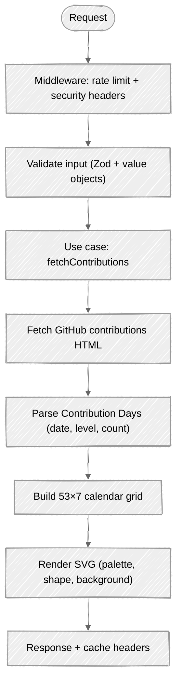

# How It Works

ContribKit never touches the GitHub API. It reads the **public** contributions page that GitHub renders at `github.com/users/{login}/contributions`, parses the Contribution Days out of the HTML, builds a calendar grid, and renders it. No token, no OAuth, no private data.

---

## Request lifecycle (web/API)



---

## Step by step

1. **Middleware** runs first on every request. For `/api/*` paths it applies per-IP rate limiting via the Cloudflare `API_RATE_LIMITER` binding (keyed on `CF-Connecting-IP`); over the limit it returns `429` with `Retry-After: 60`. On every response it attaches the security headers (CSP, `X-Frame-Options: DENY`, `X-Content-Type-Options: nosniff`, COOP/CORP, `Referrer-Policy`, `Permissions-Policy`). See **[Web Application](Web-Application)** for the full header list.
2. **Validation** parses query/route params with Zod, then constructs domain value objects:
   - `parseUsername` trims input and tests it against a deliberately looser approximation of GitHub's rules: alphanumeric, hyphens allowed inside, 1–39 chars. It does **not** reject consecutive hyphens, so `a--b` passes here and 404s at GitHub. If a `Username` exists, it is valid.
   - `parseYear` accepts `null`/empty (→ latest rolling year), rejects non-integers, and bounds the year to `2005 … currentYear`.
   - Any invalid input becomes a typed `Failure` **before any network call**.
3. **`fetchContributions(repo)({ username, year })`** orchestrates the fetch through the repository interface (a curried use case, with the repository injected via closure).
4. **Fetching** requests the public contributions HTML from GitHub with browser-like headers. See **[Fetching Contributions](Fetching-Contributions)**.
5. **Parsing** extracts each day's `date`, `level` (0–4, run through `clampLevel`), and exact `count` (from the linked `<tool-tip>`) via regex over the HTML. See **[HTML Parsing](HTML-Parsing)**.
6. **Grid building** maps the parsed days onto a fixed 53×7 (371-cell) grid aligned to week boundaries. See **[Calendar Grid](Calendar-Grid)**.
7. **Rendering** turns the grid into an SVG string using the selected palette, shape, and background. See **[SVG Rendering](SVG-Rendering)**.
8. **Response** is returned with cache headers `public, max-age=3600, stale-while-revalidate=86400` on the data routes. Two exceptions: `/api/health` is `no-store`, and the landing page is `private` either way — `private, max-age=3600, stale-while-revalidate=86400` for an explicitly requested user, `private, no-store` otherwise.

The `/api/contributions` and `/user/:username.svg` routes instantiate the repository and use cases **once at module load** (not per request), so warm Worker isolates reuse them.

---

## Errors never throw

Every function that can fail returns `T | Failure` and never throws. A `Failure` is a typed discriminated union created by small constructors (`notFound`, `invalidInput`, `network`, `parse`) and narrowed with the `isFailure` guard:

```ts
type Failure =
  | { kind: "NotFound"; username: string }
  | { kind: "InvalidInput"; field: "username" | "year"; message: string }
  | { kind: "Network"; status?: number; message: string }
  | { kind: "Parse"; message: string };
```

At the HTTP boundary, `statusFor` and `messageFor` (in `application/http/failure-http.ts`) map a `Failure` to a status code and a user-facing message. This is the **only** place that mapping lives:

| Failure | Typical cause | `statusFor` | `messageFor` |
|---------|---------------|-------------|--------------|
| `InvalidInput` | malformed username or year | `400` | the failure's `message` |
| `NotFound` | GitHub returned 404 for the user | `404` | `"User not found"` |
| `Network` | GitHub unreachable or non-OK status | `502` | the failure's `message` |
| `Parse` | HTML structure changed, no Contribution Days found | `502` | the failure's `message` |

Responses with status `>= 500` are logged to Better Stack with the username, failure `kind`, reason, status, and endpoint (`api`, `svg` or `page` — the landing page logs its own 5xx too).

---

## See also

- **[Architecture](Architecture)** describes the layers behind this flow.
- **[API Reference](API-Reference)** lists the endpoints that trigger it.
