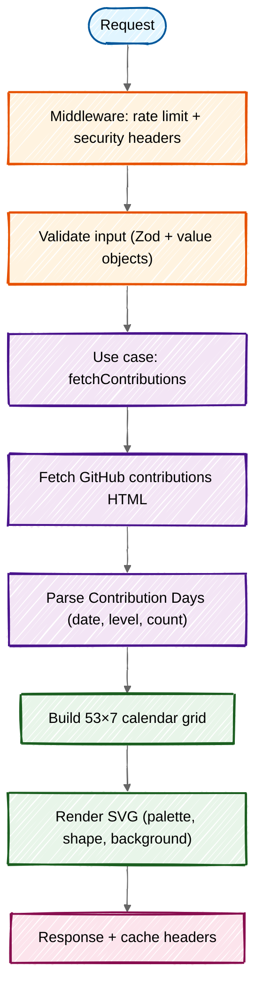

<div align="center">


# ContribKit · Web

**The [contribkit.app](https://contribkit.app) site and public API: Astro + TypeScript on Cloudflare Workers.**

[](https://github.com/fbuireu/contribkit/actions/workflows/ci.yml)
[](https://codecov.io/gh/fbuireu/contribkit)

**[Project overview](../README.md)** · **[Website](https://contribkit.app)** · **[App docs](../app/README.md)**

</div>

---

## Table of Contents

- [Embedding in Your README](#embedding-in-your-readme)
- [API](#api)
- [How It Works](#how-it-works)
- [Architecture](#architecture)
- [Development](#development)
- [Environments & Deploys](#environments--deploys)
- [Environment Variables](#environment-variables)
- [Observability](#observability)

---

## Embedding in Your README

### Basic

```markdown

```

### With options

```markdown

```

<details>
<summary><strong>All query parameters</strong></summary>

| Parameter    | Default       | Values                                                                                                                      |
| ------------ | ------------- | ---------------------------------------------------------------------------------------------------------------------------- |
| `palette`    | `github`      | `github`, `catppuccin`, `nord`, `dracula`, `gruvbox`, `sunset`, `tokyonight`, `onedark`, `rosepine`, `solarized`, `monokai` |
| `shape`      | `rounded`     | `rounded`, `square`, `circle`, `dot`, `hex`                                                                                  |
| `background` | `transparent` | `transparent`, any hex color (`#101010`), or a CSS color name                                                                |

Unknown values silently fall back to the default, so the image never breaks.

</details>

---

## API

| Endpoint                             | Returns            | Description                                                              |
| ------------------------------------ | ------------------ | ------------------------------------------------------------------------ |
| `GET /user/:username.svg`            | `image/svg+xml`    | Rendered calendar; accepts `palette`, `shape`, `background` query params |
| `GET /api/contributions?user=&year=` | `application/json` | Contribution Days as `days` (`date`, `level`, `count`) plus yearly total; `cells` is a deprecated alias for the same array |
| `GET /api/health`                    | `application/json` | Deployment health: env vars/bindings presence (never values)             |

- **Caching.** Both data responses are `public, max-age=3600, stale-while-revalidate=86400`.
- **Rate limiting.** Only `/api/*`, per IP, at 100 req/min. `/user/:username.svg` is deliberately not, because README embeds reach it through GitHub's shared image proxy ([ADR 0010](../docs/adr/0010-rate-limit-only-the-json-api.md)).
- **Backing off.** A `429` carries `Retry-After` in seconds whenever a wait is known (`60` from our own limiter, GitHub's own figure when GitHub is the one throttling), and no header at all when it is not, rather than a guess.
- **Security headers.** Set by the [middleware](src/middleware.ts) on every server-rendered response, including the CSP.
- **The one exemption.** The SVG route, and only that route, is served `Cross-Origin-Resource-Policy: cross-origin` so the calendar embeds outside GitHub ([ADR 0017](../docs/adr/0017-the-svg-endpoint-opts-out-of-the-same-origin-resource-policy.md)).
- **Static assets never reach that middleware.** Workers Assets answers them before the Worker runs, so `public/_headers` carries `X-Content-Type-Options`, `Referrer-Policy` and `X-Frame-Options` for them. The Cloudflare adapter merges its own `/_astro/*` `Cache-Control` rule into that file rather than replacing it.

---

## How It Works



ContribKit reads GitHub's **public** contributions page: no API token, no OAuth scopes, no private data. Errors are typed domain `Failure`s mapped to HTTP statuses at the boundary; nothing throws across layers.

---

## Architecture

DDD-ish layers; each one documents its own rules in a colocated `CLAUDE.md`:

| Layer                                                  | Role                                                            |
| ------------------------------------------------------- | --------------------------------------------------------------- |
| **[domain](src/domain/CLAUDE.md)**                     | Pure business core: value objects, entities, failures, geometry |
| **[application](src/application/CLAUDE.md)**           | Curried use cases and `Failure` → HTTP mapping                  |
| **[infrastructure](src/infrastructure/CLAUDE.md)**     | GitHub scraping, SVG string renderer, logging                   |
| **[ui](src/ui/CLAUDE.md)**                             | Astro components, client interactivity, styles                  |
| **[ui/components](src/ui/components/CLAUDE.md)**       | Component groups, colocation and error-page rules               |
| **[pages](src/pages/CLAUDE.md)**                       | Routes: the only layer that wires everything together            |

---

## Development

```bash
pnpm install
```

| Command                  | Action                                      |
| ------------------------ | ------------------------------------------- |
| `pnpm dev`               | Local dev server (generates wrangler types) |
| `pnpm wrangler:dev`      | Build + run under the Workers runtime       |
| `pnpm build`             | Production build                            |
| `pnpm test`              | Vitest unit tests                           |
| `pnpm test:e2e`          | Playwright e2e tests                        |
| `pnpm lint:all`          | Biome lint                                  |
| `pnpm lint:astro`        | `astro check` (Astro diagnostics)           |
| `pnpm lint:ts:typecheck` | `tsc --noEmit`                              |
| `pnpm format:all`        | Biome format (write)                        |
| `pnpm format:check`      | Biome format check (read-only, runs in CI)  |

---

## Environments & Deploys

Both deploys run from [`ci.yml`](../.github/workflows/ci.yml) and only after `web-check` (lint + test) and `web-build` (build + typecheck) pass:

- **Production**: every push to `main` matching the workflow's path filter builds with `CLOUDFLARE_ENV=production` then `wrangler deploy` → worker `contribkit` on `contribkit.app`. Decoupled from semantic-release (which only versions).
- **Development**: every PR matching the same filter builds with `CLOUDFLARE_ENV=development` and deploys an ephemeral worker `pr-<n>-contribkit-development` (`wrangler deploy --name …`) on `*.workers.dev`; the PR gets a comment with the URL, and the worker is deleted when the PR closes.

> [!NOTE]
> That path filter is `web/**`, `shared/**`, `docs/**`, `scripts/**`, `*.md` and the root [`package.json`](./package.json) / [`pnpm-workspace.yaml`](../pnpm-workspace.yaml) / [`lefthook.yml`](./lefthook.yml), plus its own workflow file and the `prepare-env` action it uses; not `web/**` alone. The documentation-consistency contract runs inside `web-check` and has to fire on documentation changes to be worth anything; `scripts/**` and the root manifest were added late, after a change to the very version pins the contract asserts started no workflow at all. The consequence is that a documentation-only push to `main` redeploys the Worker. Accepted: the deploy is idempotent, and narrowing the filter would silently disable the guard ([ADR 0015](../docs/adr/0015-the-maintenance-contract-is-enforced-by-a-test.md)).

> [!IMPORTANT]
> **How environments work with `@astrojs/cloudflare`:** the adapter resolves the [`wrangler.toml`](./wrangler.toml) `[env.NAME]` block **at build time** into `dist/server/wrangler.json`. You select it with `CLOUDFLARE_ENV=<env> astro build`, then deploy with a plain `wrangler deploy` (and `--name` for previews). Do not pass `wrangler deploy --env <env>` on top of it. The generated config carries a `targetEnvironment` that wrangler checks the flag against, so a matching `--env` is a no-op and a mismatching one is a hard error. The deploy workflow carried a redundant `--env` until this was executed; it is gone.

See the **[root README](../README.md#monorepo-development)** for the GitHub Environments naming convention shared with the app.

---

## Environment Variables

All BetterStack/GA vars are build-time (`import.meta.env`, Vite-inlined). The BetterStack source token is the same for browser RUM and the server logger; since the browser already exposes it, a single public var is used for both: no separate runtime secret.

| Variable                            | Type            | Used by                                     | Where it lives                  |
| ----------------------------------- | --------------- | -------------------------------------------- | ------------------------------- |
| `PUBLIC_GOOGLE_ANALYTICS_ID`        | build-time      | GA (browser)                                 | GitHub Environment **variable** |
| `PUBLIC_BETTER_STACK_SOURCE_TOKEN`  | build-time      | BetterStack RUM (browser) + logger (server)  | GitHub Environment **variable** |
| `PUBLIC_BETTER_STACK_INGESTING_URL` | build-time      | BetterStack logger endpoint (server)         | GitHub Environment **variable** |
| `API_RATE_LIMITER`                  | runtime binding | rate limiter                                 | `wrangler.toml` per env         |

Hit [`/api/health`](https://contribkit.app/api/health) to verify which vars/bindings the deployed worker was built/configured with (presence only, never values).

---

## Observability

- **Server logs:** Better Stack via [`better-stack-logger`](src/infrastructure/logging/better-stack-logger.ts) (5xx failures and unhandled 500s).
- **Worker telemetry:** Cloudflare observability (logs + traces, 20% head sampling) configured per env in [`wrangler.toml`](wrangler.toml).
- **Tail worker:** [`workers/tail`](workers/tail/index.ts) forwards Worker logs and exceptions to Better Stack. It is **deployed by hand**, from its own directory: no workflow and no `pnpm` script builds it. The service name in its `wrangler.toml` is what both `[[tail_consumers]]` blocks in [`wrangler.toml`](wrangler.toml) point at, and the docs contract asserts the three agree, because a rename would stop log forwarding without failing anything.
- **Browser RUM + analytics:** Better Stack telemetry and GA4, loaded only after cookie consent.
